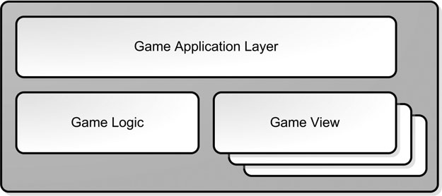

# Arhitektura igre

## Slojevi igre (*game layers*)

Prema knjizi *Game Coding Complete*, svaki podsistem u igri može biti svrstan u jednu od tri osnovne kategorije:

* Sloj aplikacije (*application layer*, bavi se hardverom)
* Sloj logike igre (*game logic layer*, bavi se stanjem igre i kako se ono menja)
* Sloj prikaza igre (*game view layer*, prezentuje stanje igre sa grafikom i zvukom)



The application layer concerns itself with the machine your game runs on. If you were going to port your game from Windows to iOS or Android, you would rewrite most of the code in the application layer, but hopefully not much else. In this area is code that deals with hardware devices like the mouse or a gamepad, operating system services such as network communications or threading, and operations such as initialization and shutdown of your game.

The game view is responsible for presenting the game state and translating input into game commands that are then sent to the game logic. What’s interesting about the game view is that it can have different implementations, and you can have as many views attached to your game as your computer can handle.

If you structure your game correctly and factor all language-specific files, such as strings into separate files, you’ll find it a lot easier to translate your game into other language.

## Komunikacija preko događaja

Whenever in your game something important happens (complete quest, destroying an actor), you should fires off an event. Your game must then notify all the appropriate subsystems that the event has occurred so that they can handle the event in their own way.

In a well-designed game, each subsystem should be responsible for subscribing to and handling game events as they pass through the system.

Uobičajeni događaji:

```java
Enum EventType
{
  Event_Object_Moved,
  Event_Object_Created,
  Event_Object Destroyed,
  Event_Guard_Picked_Nose,
  // and on and on....
};
```
