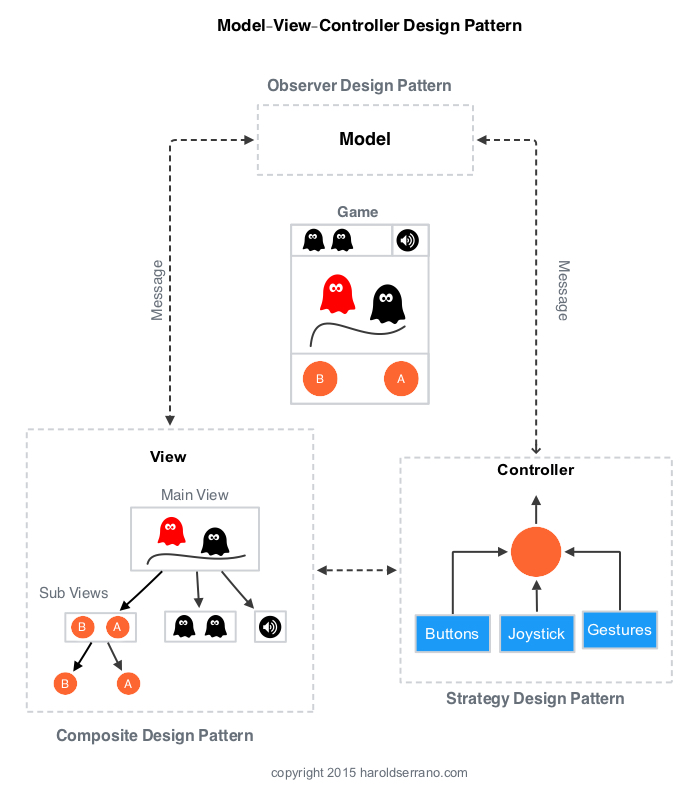

## Model-View-Controller

Model-View-Controller is the most widely used and loved design pattern among programmers. Harold Serrano smatra da se u razvoju igara MVC sastoji od tri osnovna obrasca:

* Observer Pattern (Model)
* Composite Pattern (View)
* Strategy Pattern (Controller)

The strategy pattern decouples user inputs from the game's logic (Model) and interfaces (View).
