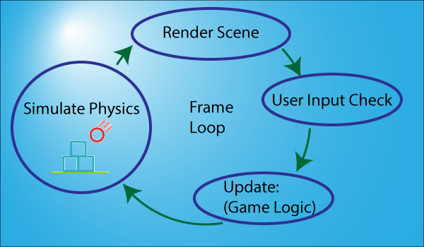

# Glavna petlja (*main loop*)

Za razliku od običnih programa, nakon pokretanja, čak i ako igrač ništa ne radi, igra neprestano ide. Zato u svim igrama postoji glavna petlja ili *game loop*. A typical main loop will receive and process player input, update game logic (world, enemies...) and render the scene. Every main loop is different and tailored for each individual game.


Ovako izgleda najprostiji primer glavne petlje:
```js
const glavnaPetlja = () => {
  handleInput()
  update()
  render()
}
```

It is important that `render()` is called after `update()` because we want the screen to reflect a state of the application. U `update` fazi se dešavaju sva računanja vezana za logiku igre, na primer:
```
  run AI
  move enemies
  resolve collisions
```

Obično u `render` fazi ide i `audio`, tj. muzika i zvučni efekti.

Za igre sa fizikom, glavna petlja će izgledati ovako:

```js
const glavnaPetlja = () => {
  input()
  update()
  simulatePhysics()
  render()
}
```



All of these operations occur in one giant loop that can’t take longer than 33ms per iteration (30 puta per second), ili 16.6ms po iteraciji (60 puta u sekundi).

# Podela glavne petlje

U pravim igrama glavne petlje teže da postanu prilično velike. Velika glavna petlja može biti podeljena na dve petlje: `update` i `render`.


Update petlja može izgledati ovako u pseudokodu:

```
Player update
   Sense Player input
   Compute restrictions
   Update player state
World update
   Passive elements
      Pre-select active zone for engine use
   Logic-based elements
      Sort according to relevance
      Execute control mechanism
      Update state
   AI based elements
      Sort according to relevance
      Sense internal state and goals
      Sense restrictions
      Decision engine
      Update world
```

Render loop može izgledati ovako:
```
World presentation
   Select visible subset (graphics)
      Clip
      Cull
      Occlude
   Select resolution
   Pack geometry
   Render world geometry
   Select audible sound sources (sound)
      Pack audio data
      Send to audio hardware
NPC presentation
   Select visible subset
   Animate
   Pack
   Render NPC data
Player presentation
   Animate
   Pack
   Render
```

One problem with rendering is that your CPU spends most of its time waiting for the video card to process what it just sent. By putting the rendering system on another thread, you free up the CPU while the GPU is working its magic.

# Glavna petlja sa delta vremenom

```js
let then = Date.now();

const mainLoop = () => {
	requestAnimationFrame(mainLoop);
	const now = Date.now();
	const delta = now - then;
	update(delta / 1000);
	render();
	then = now;
}
```

We get the modifier to send to update by dividing by 1000 (the number of milliseconds in one second).

```js
const update = function (modifier) {
	hero.x -= hero.speed * modifier;
}
```

Modifier is a time-based number based on 1. If exactly one second has passed, the value will be 1 and the hero's speed will be multiplied by 1. If one half of a second has passed, the value will be 0.5 and the hero will have moved half of his speed, and so forth. This function gets called so rapidly that the modifier value will typically be very low, but using this pattern will ensure that the hero will move the same speed no matter how fast the script is running.

# Merenje brzine

You typically aim for a target of 30-60 frames per second, which means game loop must fit within 33-16 milliseconds.


