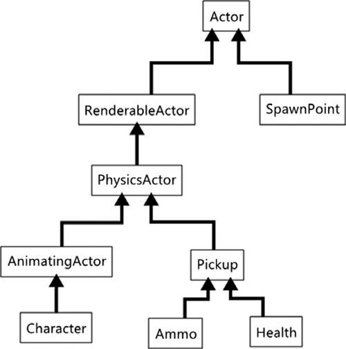

# Hijerarhija klasa: Keep Them Flat

A good rule of thumb is that each class should have a single responsibility in your code base and should have inheritance trees that are no more than two or three levels deep.

If at all possible, try to never use multiple inheritance unless every base class you’re deriving from has nothing but pure virtual functions.

Eventually, you’d probably end up with a big inheritance tree like this one:

## User interface class

You might have a base control class to handle things like mouse and keyboard events, positioning, and anything else that all controls need to know how to do. When you create a control such as a button or check box, you will inherit from this control.

## Actor class

A game actor is an object that represents a single entity in your game world. It could be an ammo pickup, a tank, a couch, an NPC, or anything you can think of.

## Inheritance vs. Composition

Inheritance is used when an object has evolved from another object, or when a child object is a version of the parent object. Composition is used when an object is composed of multiple discrete components, or when an aggregate object has a version of the contained object.

Converting “is-a” relationships into “has-a” relationships can be a useful technique for reducing the width, depth, and complexity of a game’s class hierarchy.
