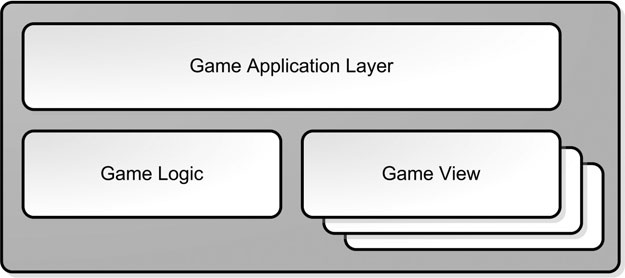

# Pogon igre (game engine)

Game engine se sastoji od:
* physics engine
* graphics engine
* audio engine
* AI engine
and whatever other engines you may require.

# Arhitektura igre

## Slojevi igre (Game Layers)
(Book Game Coding Complete)

Every game subsystem could be classified into one of three primary categories:

* The application layer (deals with the hardware and the operating system)
* The game logic layer (manages your game state and how it changes over time)
* The game view layer (presents the game state with graphics and sound)

Ovo je nalik Model-View-Controller arhitekturi kod aplikacija.



The application layer concerns itself with the machine your game runs on. If you were going to port your game from Windows to iOS or Android, you would rewrite most of the code in the application layer, but hopefully not much else. In this area is code that deals with hardware devices like the mouse or a gamepad, operating system services such as network communications or threading, and operations such as initialization and shutdown of your game.

The game view is responsible for presenting the game state and translating input into game commands that are then sent to the game logic. What’s interesting about the game view is that it can have different implementations, and you can have as many views attached to your game as your computer can handle.

If you structure your game correctly and factor all language-specific files, such as strings into separate files, you’ll find it a lot easier to translate your game into other language.

## Komunikacija preko događaja

Whenever in your game something important happens (complete quest, destroying an actor), you should fires off an event. Your game must then notify all the appropriate subsystems that the event has occurred so that they can handle the event in their own way.

In a well-designed game, each subsystem should be responsible for subscribing to and handling game events as they pass through the system.

Uobičajeni događaji:

```java
Enum EventType
{
  Event_Object_Moved,
  Event_Object_Created,
  Event_Object Destroyed,
  Event_Guard_Picked_Nose,
  // and on and on....
};
```

## Razdvajanje briga

The World should not draw itself; the Renderer should draw the World. The Player should not draw itself; the Renderer should draw the Player relative to the World.

Here is how a typical rendering engine handles these things:

1. Drawing an object

You typically have a Renderer class that does this. It simply takes an object (Model) and draws in on the screen. It can have methods like drawSprite(Sprite), drawLine(..), drawModel(Model), whatever you feel like needing.

It also uses any API you have underneath so you can have for instance a renderer that uses WebGL and one that uses Canvas. If you want to port your game to another platform, you simply write a new renderer and use that one.

2. Moving an object

Each object is attached to something we like to refer to as a SceneNode. You achieve this through composition. A SceneNode contains an object. That's it. What's a SceneNode? It's a simple class containg all the transformations ( position, rotation, scale ) of an object ( usually relative to another SceneNode ) together with the actual object.

3. Managing the objects

How are SceneNodes managed? Through a SceneManager. This class creates and keeps track of every SceneNode in your scene. You can ask it for a specific SceneNode ( usually identified by a string name like "Player" or "Table" ) or a list of all the nodes.

4. Drawing the world

This should be pretty obvious by now. Simply walk through every SceneNode in the scene and have the Renderer draw it in the right place. You can draw it in the right place by having the renderer store the transformations of an object before rendering it.

5. Collision Detection

This isn't always trivial. Usually you can query the scene about what object is at a certain point in space, or what objects will a ray intersect. This way you can create a ray from your player in the direction of the movement and ask the scene manager what's the first object that ray intersects. You can then choose to move the player to the new position, move him by a smaller amount ( to get him next to the colliding object ) or not move him at all. Make sure to have these queries handled by separate classes. They should ask the SceneManager for a list of SceneNodes, but it's another task to determine whether that SceneNode covers a point in space or intersects with a ray. Remember that the SceneManager only creates and stores nodes.
