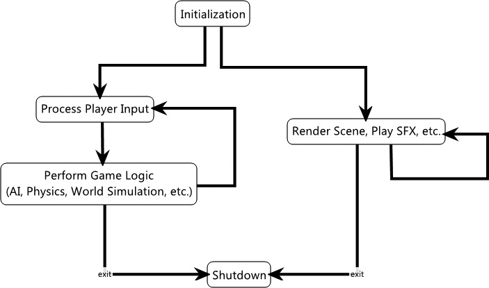

# Game loop

A typical main loop may receive and process player input, run creature AI, update animations, update the physics system, run any world simulation that needs to happen, render the scene, and play music and sound effects. Every main loop is different and tailored for each individual game.

In pseudocode, might look something like this:

```
while( user doesn't exit )
  check for user input
  run AI
  move enemies
  resolve collisions
  draw graphics
  play sounds
end while
```

Malo detaljniji loop može biti podeljen na update i render. Update loop može izgledati ovako:
```
Player update
   Sense Player input
   Compute restrictions
   Update player state
World update
   Passive elements
      Pre-select active zone for engine use
   Logic-based elements
      Sort according to relevance
      Execute control mechanism
      Update state
   AI based elements
      Sort according to relevance
      Sense internal state and goals
      Sense restrictions
      Decision engine
      Update world
End
```

Render loop može izgledati ovako:
```
World presentation
   Select visible subset (graphics)
      Clip
      Cull
      Occlude
   Select resolution
   Pack geometry
   Render world geometry
   Select audible sound sources (sound)
      Pack audio data
      Send to audio hardware
NPC presentation
   Select visible subset
   Animate
   Pack
   Render NPC data
Player presentation
   Animate
   Pack
   Render
```

All of these operations occur in one giant loop that can’t take longer than 33ms per iteration (30 iterations per second).

Za razliku od klasičnih programa, even if the player does absolutely nothing, the game still needs to be constantly thinking and processing.


One problem with rendering is that your CPU spends most of its time waiting for the video card to process what it just sent. By putting the rendering system on another thread, you free up the CPU while the GPU is working its magic.


