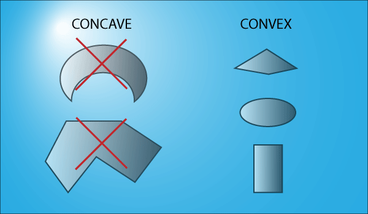
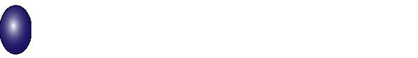

# Fizičko telo

Svaki fizički predmet ima prikačeno fizičko telo. Fizička tela su prosti oblici koji grubo definišu veličinu i oblik vašeg lika.


Fizičko telo nije predefinisano slikom vašeg lika i obično je nevidljivo u igri. Oblik kreirate pozivanjem metode za crtanje oblika. Zatim povezujete telo sa likom i stičete pristup simuliranim efektima i svojstvima dodeljenim tom telu. Obično je fizičko telo igrača malo manje od slike lika.

Možete imati više fizičkih tela povezanih sa jednim likom. Uzmite, na primer, lik heroja koji nosi mač. Imalo bi smisla kreirati jedno telo za junaka, a drugo za mač. To bi vam omogućilo da kreirate logiku igre na osnovu sudara različitih tela.

U pseudokodu:

```js
function collisionDidOccur() {
  switch (collision) {
  case (player && sword):
    //do nothing;
    break;
  case (player && enemy):
    //ouch!!;
    break;
  case (sword && enemy):
    //do damage!!;
    break;
  }
}
```

## Ograničenja



Većina fizičkih pogona ima sledeća ograničenja:
* moraju se koristiti konveksni oblici (nijedan unutrašnji ugao nije manji od 180 stepeni)
* primenjuje se samo fizika čvrstih tela

Kada loptica udari zid u "stvarnom" svetu, nešto slično ovome će se dogoditi:



Slika vašeg lika može da doživi ovaj tip transformacije, ali njegovo fizičko telo ne može. Možete kontrolisati određene osobine tela da utiču na njegovu "poskočnost", ali ne može zaista imati mutabilni oblik. Ovo se zove čvrsto telo, što znači da se ne može deformisati ili istisnuti.

## Svojstva

Some of the most useful properties available on a typical physics body are:
* `Restitution` is a measure of how "bouncy" an object is. More formally, it's the measure of how much energy an object retains after it collides with another object.
* `Density` is the measure of how "heavy" an object is. It is used as a relative quality—for instance, a rock would be more dense than a ball, so when the ball hits the rock, it will be affected more heavily.
* `Friction` is the measure of how "slippery" an object is. This is used when one object is sliding along another, and determines how long will it take for it to stop.
* If a body is `dynamic`, then forces imposed upon it by the world and other objects will have an effect; if it is a `static` body, then they will not.
* `Rotation` is typically a Boolean variable that can be set on a physics body. In certain cases you may want to limit a body and not allow it to rotate, but you want forces to still be applied to that object.

Ovo su neka od najkorisnijih svojstava dostupnih na tipičnom fizičkom telu:

* `Restitucija` (povraćaj) je mera koliko je nešto "poskočno". Formalno, to je mera koliko energije predmet zadržava nakon što se sudari s drugim predmetom.
* `Gustina` je mera koliko je nešto "teško". Koristi se kao relativna kvaliteta - na primer, kamen bi bio gušći od lopte, tako da će kada lopta udari u kamen, biti više pogođena.
* `Trenje` je mera koliko je nešto "klizavo". To se koristi kada jedan objekt klizi po drugom, i određuje koliko će vremena trebati da zaustavi.
* Ako je telo `dinamično`, onda sile koje su mu nametnute od strane sveta i drugih objekata imaju učinak, a ako je to `statično`, nemaju.
* `Rotacija` je tipično bulova varijabla koja se može postaviti na fizičko tijelo. U nekim slučajevima možda ne želite dozvoliti mu rotiranje, ali želite da se sile i dalje primjenjuju.