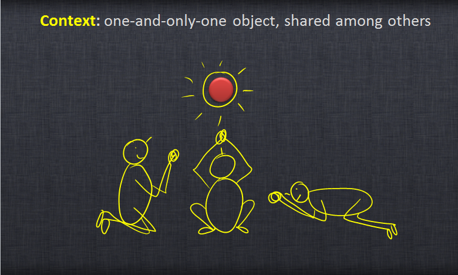

## Jedinstvenik (*Singleton*)

Singleton ili jedinstvenik je globalni objekat za koji postoji samo jedan primerak u celoj aplikaciji. Svim igrama trebaju svima dostupni globalni objekti. Menadžer tekstura, kontroler džojstika i klasa igrača su singletoni.

Svi "primerci" singletona zapravo pokazuju na istu strukturu. Ovaj obrazac se tako implementira da pokušaj kreiranja nove instance kreira singleton samo za prvi poziv, te vraća pokazivače na njega u narednim pozivima.

