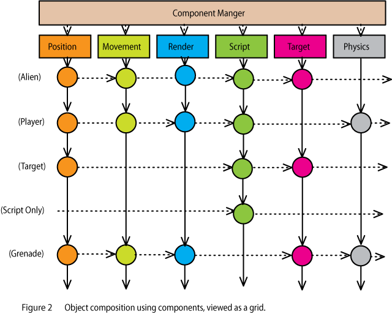

## Kompozitni obrazac (*Composite pattern*)

> pravi graf scene od renderabilnih objekata

Kompozitni obrazac sastavlja objekte u strukture (poput stabla) koje predstavljaju hijerarhije. Primer može biti nivo igre, gde imamo više različitih delova, kao što su podnivoi, drveće, neprijatelji i sl., i želimo ih sakupiti u kolekciju.



Mnogi tipovi aplikacija, posebno igre, treba da sadrže raznorodnu kolekciju podataka. Nivo igre može imati podnivoe, napitke, neprijatelje, predmete i sl. Ukupna struktura podataka se može opisati kao hijerarhija celina-deo, sa svakim elementom koji je ili primitiv ili kompozit. Čuvanje svih podataka u jednoj strukturi čini pretraživanje lakšim. Tako možemo pristupati primitivima i kompozitima korišćenjem standardnog interfejsa.

## Primer

Klasa `Level` predstavlja ceo nivo, a zatim koristimo klasu `LevelItem` da opišemo primitivne entitete unutar tog nivoa: napitke, predmete koje igrač može da uzme i sl.

```java
class Level {
  public:
    const char* Name() { return _name; }
    virtual float LifePoints();
    virtual int NumEnemies();
    virtual void Add(LevelItem*);
    virtual void Remove(LevelItem*);
    virtual Iterator<LevelItem*>* CreateIterator();
  protected:
    LevelItem(const char*);
  private:
    const char* _name;
};

class Potion: public LevelItem {
  public:
    Potion(const char*);
    virtual float LifePoints();
};

class CompositeItem : public LevelItem {
  public:
    virtual float LifePoints();
    virtual int NumEnemies();
    virtual void Add(LevelItem*);
    virtual void Remove(LevelItem*);
    virtual Iterator<LevelItem*>* CreateIterator();
  protected:
    CompositeItem(const char*);
  private:
    List<LevelItem*> _items;
};

float CompositeItem::LifePoints() {
    Iterator<LevelItem*>* i = CreateIterator();
    float total = 0;
    for (i->First(); !i->IsDone(); i->Next()) {
        total += i->CurrentItem()->LifePoints();
    }
    delete i;
    return total;
}

int CompositeItem::NumEnemies() {
    Iterator<LevelItem*>* i = CreateIterator();
    int total = 0;
    for (i->First(); !i->IsDone(); i->Next()) {
        total += i->CurrentItem()->NumEnemies();
    }
    delete i;
    return total;
}

class Enemy : public CompositeItem{
  public:
      Enemy(const char*);
      virtual float LifePoints();
      virtual int NumEnemies();
};

class SubLevel: public CompositeItem{
  public:
      SubLevel(const char*);
      virtual float LifePoints();
      virtual int NumEnemies();
};

void LordOfTheRings () {
  Level* MiddleEarth=new Level("Middle Earth");
  SubLevel* TheShire= new SubLevel("TheShire");
  SubLevel* Moria= new SubLevel("Mines of Moria");
  MiddleEarth->Add(TheShire);
  MiddleEarth->Add(Moria);
  Enemy *Nazgul=new Enemy("Nazgul");
  Enemy *NazgulRider=new Enemy("NazgulRider");
  Enemy *NazgulSteed=new Enemy("NazgulSteed");
  Nazgul->Add(NazgulRider);
  Nazgul->Add(NazgulSteed);
  TheShire->Add(Nazgul);
  Enemy *Balrog=new Enemy("Balrog");
  Moria->Add(Balrog);
  Potion *Lembas=new Potion("Lembas");
  TheShire->Add(Lembas);
  cout << "The number of monsters in Middle Earth is " << MiddleEarth->NumEnemies() << endl;
  cout << "The life points for the monsters are " << MiddleEarth-
  >LifePoints() << endl;
}
```

Ovaj kod kreira hijerarhiju na osnovu Gospodara prstenova. Kao rezultat, kreiramo dva podnivoa (`Moria` i `The Shire`) i zatim mnoštvo stvorenja i napitaka u svakoj zoni.