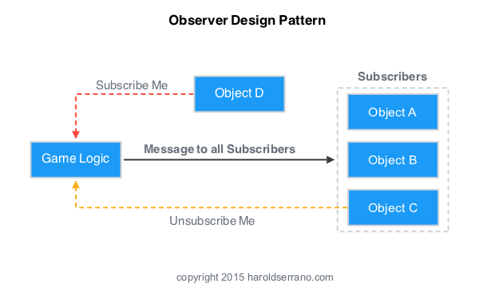

# Posmatrač (*Observer Pattern*)

> ima renderabilne predstave karaktera, sluša događaje iz logike igre kako bi promenio vizuelnu prezentaciju kada je potrebno, bez potrebe da zna bilo šta o kodu renderera.

U igri, sve naše klase treba da budu labavo povezane. Ovo znači da klase imaju mogućnost da razgovaraju, ali da imaju malo znanja jedna o drugoj. Činjenje klasa labavo povezanim čini igru modularnom i fleksibilnom za razvoj.

Model posmatrača se obično implementira kada objekt želi da šalje poruke svojim pretplatnicima (drugim objektima). Objekt ne treba da zna ništa o tome kako rade pretplatnici.

Posmatrač je tako široko rasprostranjen, da ga je Java stavila u svoju osnovnu biblioteku (java.util.Observer), a C# ga je ugradio direktno u jezik (ključna reč event).

Recimo da dodajemo sistem dostignuća u našu igru. Model Posmatrača omogućava jednom delu koda da objavi da se nešto zanimljivo dogodilo, bez da brine ko prima obaveštenje.
