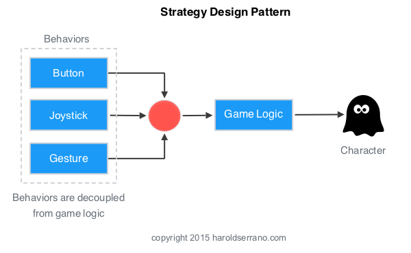

## Strateški obrazac (Strategy pattern)

> switch between different heuristics for your A* search, depending on what sort of terrain you're in

Sometimes you will need to create objects whose behavior can be changed dynamically. Take a soldier, for example. He might have an update routine that recalculates all his AI. Imagine that his AI can be one of four types: an AI routine to fight, one to escape, one to stay idle, and one to follow a trajectory with his squad mates.

Here is where the strategy pattern kicks in. Its goal is to separate the class definition from one (or several) of its member algorithms, so these algorithms can be interchanged at runtime.

The implementation of the strategy pattern involves two classes. First, there is the strategy class, which provides the strategic algorithm. This is a pure abstract class, from which specific strategies are derived as subclasses. Second, there is the context class, which defines where the strategy should be applied and has a member that executes the selected strategy and swaps strategies when needed.

In a game, you should always decouple the interaction between the input controller and the game's logic. The game's logic should receive the same kind of input regardless of the input controller (button, gesture, joystick).

This decoupling behavior and flexibility are possible thanks to a design pattern known as Strategy Design Pattern.
