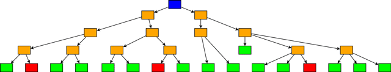
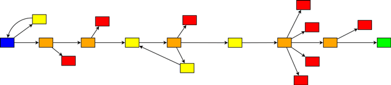
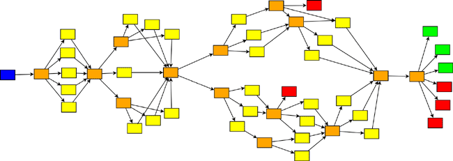
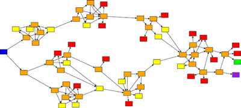
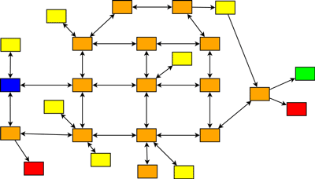
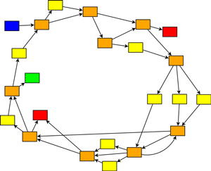

# Standardni obrasci za avanturu

## Vremenska pećina (*Time Cave*)

Složena sekvenca s mnogim izborima. Svi izbori su otprilike jednako važni, a nema previše ponovnog spajanja, te stoga nema potrebe za praćenjem stanja. Postoji mnogo, mnogo svršetaka.

**Efekti**: Vremenska pećina je najstarija i najočiglednija CYOA (*Choose Your Own Adventure*) struktura. Često je dobra za narative o slobodi i otvorenoj mogućnosti, avanturama koje mogu ići bilo gde. Vremenske pećine tendiraju da imaju relativno kratke partije, ali jako potiču na ponovno igranje: one su široke, a ne dugačke. Čak i nakon više igranja, većina igrača će propustiti dobar deo sadržaja.

## Špalir (*Gauntlet*)

Špaliri su obično duži nego širi, sa relativno linearnim centralnim nitima koje se sužavaju kroz grane koje završavaju smrću, povratkom unazad ili ponovnim spajanjem. Špalir obično priča jednu odabranu priču, koja može biti ukrašena opcionim sadržajem. Ako ima više svršetaka, oni su verovatno rezultat finalnog odabira. Špaliri retko zavise od stanja u većoj meri (inače će se verovatno razviti u strukturu *grana i uska grla*).

**Efekti**: Igrač će vjerojatno shvatiti da se nalazi na ograničenom putu, ali bočne grane igraju veliku ulogu - da li to znači smrt? netačne odgovore? putovanje unazad u vreme? blokirane staze? Najčešće, špalir stvara atmosferu opasnog, teškog ili ograničenog svijeta. Ponekad to može biti zastrašujuće ili tužno; ponekad mračno komično; ponekad to znači da ste u delu koje se pretežno oslanja na refleksivne ili retoričke izbore. Možda najlakša struktura za autora, špaliri su poput linearne priče i omogućuju da većina igrača vidi većinu važnog sadržaja.

## Grane i uska grla (*Branch and Bottleneck*)

Igra se grana, ali grane se redovno spajaju, obično oko događaja koji su zajednički za sve verzije priče. Da bi se izbeglo brisanje efekata prošlih izbora, strukture grana i uskih grla se skoro uvek oslanjaju na intenzivno praćenje stanja (ako igra to ne radi, velike su šanse da imate posla sa *rukavicom*).

Donekle retko, uska grla mogu biti nevidljiva – zaplet se grana i nikada ne dostiže eksplicitni čvor za ponovno spajanje, ali izbori na kraju svake grane su isti ili slični.

**Efekti**: Igre sa granama i uskim grlom imaju tendenciju da su pretežno vođene protokom vremena. Ova struktura najčešće se koristi da odražava rast karaktera igrača: omogućava igraču da konstruiše donekle prepoznatljivu priču i ličnost, dok i dalje dozvoljava radnju kojom se može upravljati. Postoji tendencija da igranja budu dosta slična u ranoj igri, a zatim se razilaze kako se efekti ranijih izbora gomilaju. 

## Potraga (*Quest*)

Struktura potrage formira razne grane, koje imaju tendenciju da se ponovo spoje u relativno mali broj pobedničkih završetaka (često samo jedan). Elementi ovih grana imaju modularnu strukturu: mali, čvrsto grupisani klasteri čvorova koji omogućuju mnogo načina da se pristupi situaciji, sa puno međupovezanosti unutar svakog klastera i relativno malo izvan njega. Ponovno spajanje je prilično uobičajeno; nazadovanje, manje. Potrage generalno uključuju određeni nivo praćenja stanja i loše rade kada to ne čine. Minimalna veličina za misiju je relativno velika, a ova kategorija uključuje neke od najvećih CYOA.

**Efekti**: Ovaj režim je veoma pogodan za istraživačko putovanje; struktura potrage obično se organizuje prema geografiji, a ne prema vremenu. Većina radova ove vrste uključuje putovanje sa određenom svrhom. Potrage dobro funkcionišu za utemeljene, dosledne svetove. Narativ ima tendenciju da bude fragmentaran ili epizodan: mali delovi priče koji možda nemaju veliki značaj za širu sliku.

## Otvorena mapa (*Open Map*)

Iako su potrage strukturirane geografijom, vreme i dalje igra važnu ulogu: postoji ugrađeni pravac putovanja. Ali ako učinite putovanje između glavnih čvorova reverzibilnim i imate statičnu geografiju, svet u kome igrač može da se muči neograničeno. Često se oslanja na ekstenzivno praćenje stanja za napredak naracije. 

**Efekti**: Kao i kod klasičnih igara zasnovanih na mapama, naracija ima tendenciju da bude sporija i manje usmerena. Igrač ima više slobodnog vremena da istražuje svet, ali troši manje vremena na napredovanje priče.

## Plutajući moduli (*Floating Modules*)

Režim koji je zaista moguć samo u računarskim igrama. Nema stabla - iako može biti razbacanih grančica i grana. Nema centralnog zapleta, nema niza: susreti postaju dostupni igraču uglavnom na osnovu stanja, ili nasumično.

**Efekti**: Ovo je izazovan stil za pisanje, i zato što ga je teško intuitivno shvatiti (autori imaju tendenciju da se brzo vrate jedinstvenijoj strukturi) i zato što se o prethodnim događajima može praviti malo pretpostavki. Bez velike količine sadržaja, plutajući moduli imaju tendenciju da se uruše u linearni sistem. Pošto se mehanika igre uglavnom odnosi na menjanje statistika, postoji snažan podsticaj da se te statistike izlože igraču; karakteristika mogu biti ponovljeni događaji samo za uvećanje statistika (*grinding*).

## Petlja i rast (*Loop and Grow*)

Igra ima neku vrstu centralne niti, koja se vrti ukrug, iznova i iznova, do iste tačke: ali zahvaljujući praćenju stanja, svaki put se nove opcije mogu otključati, a druge zatvoriti. Ovo je veoma opšti obrazac i može koegzistirati sa mnogim drugim. 

**Efekti**: Petlja i rast naglašava pravilnost sveta dok zadržava narativni zamah. Potrebno je opravdanje zašto se čitavi delovi naracije mogu ponavljati: lik igrača često prati rutinske aktivnosti u poznatom prostoru, bavi se putovanjem kroz vreme ili obavlja zadatke na određenom nivou apstrakcije. Ova regularnost često dolazi po cenu otvorenosti: mnoge priče sa snažnom strukturom Petlje i rasta uključuju borbu protiv zatvorenosti ili stagnacije.

Varijacija petlje i rasta je spica i čvorište (*spoke and hub*): igra ima nekoliko glavnih grana, koje sve potiču i vraćaju se u centralni čvor ili skup čvorova. Igrač može izaći uz svaki spicu jednom ili više puta.

Izvor: https://heterogenoustasks.wordpress.com/2015/01/26/standard-patterns-in-choice-based-games/
