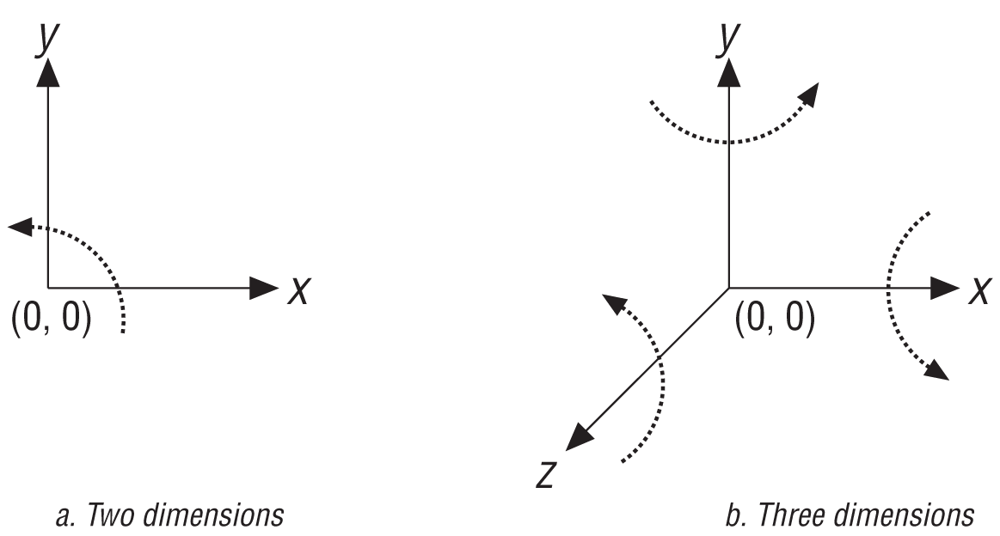
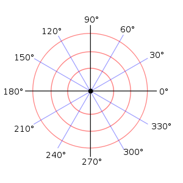

# Koordinatni sistemi

> Ako koristiš x i y, koristiš kartezijanske koordinate. Ako koristiš ugao i dužinu vektora, koristiš polarne koordinate.

## Kartezijanski 2D koordinatni sistem

Kartezijanski (Dekartov) koordinatni sistem se sastoji od horizontalne (`x`) i verticalne (`y`) ose. Svaka tačka može biti određena sa (x, y). Ishodište je tačka u kojoj se ose seku, na koordinatama (0, 0).

Dve česte konvencije za koordinatni sistem su:
* Ishodište je dole levo, sa x osom nadesno i y nagore.
* Ishodište je gore levo, sa x osom nadesno i y nadole.

## Kartezijanski 3D koordinatni sistem

Dekartov 2D koordinatni sistem se lako može proširiti na 3D, dodavanjem treće ose (`z`). Na primer, da bi dospeo do neke tačke, moraš ići 2 jedinice desno, 4 jedinice gore i 5 jedinica napred; to se može opisati nizom (2, 4, 5).

3D koordinatni sistem može biti "levoruki" i "desnoruki".

WebGL koristi desnoruki koordinatni sistem: `x` osa se proteže nadesno, `y` osa nagore, a `z` osa van ekrana:

## Polarni koordinatni sistem

U polarnom koordinatnom sistemu, položaj tačke je određen njenom udaljenošću od ishodišta i uglom. Polarni koordinatni sistem je poseban oblik cilindričnog koordinatnog sistema.

