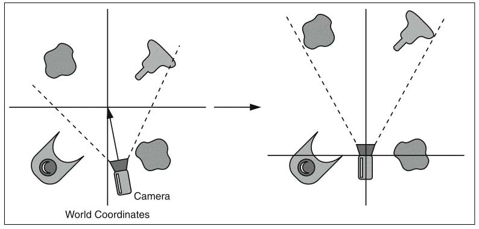
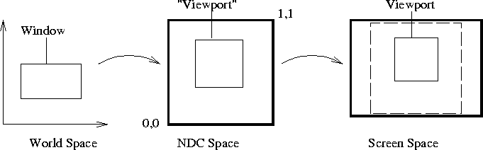

## Koordinate sveta i koordinate kamere

Naše ishodište sveta (*world origin*) nalazi se u donjem levom uglu prozora, pri čemu pozitivni x pokazuje udesno, a pozitivni y nagore.

## Normalizovane koordinate uređaja 

Normalizovane koordinate uređaja (*Normalized Device Coordinates*, skraćeno NDC) mogu biti u rasponu od [-1, 1] za obe ose, x i y. Programer dizajnira čitav ekran koristeći NDC. NDC skriva od nas tri stvarnosti hardvera:

- Stvarni broj piksela na x i y osi.
- Neravnomerno raspoređivanje piksela na x i y osi.
- Pravac Y ose - gore ili dole. Transformacija NDC-a u piksele će obrnuti Y osu ako je potrebno.

Ako direktno mapiramo koordinatni sistem sveta (WCS) na koordinatni sistem uređaja (DCS), promena uređaja zahtevala bi novo mapiranje. Umesto toga, koristimo normalizovane koordinate uređaja kao posredni sloj.

http://alfonse.bitbucket.org/oldtut/Positioning/Tutorial%2007.html
