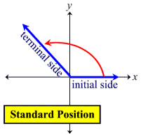

# Trigonometrija

Trigonometrija je nauka o trouglovima, ali i uglovima uopšte. Korisna je i kod krugova (i oni imaju uglove), rotacija i svake vrste cikličnog kretanja.

# Ugao

Svaki ugao se sastoji od dve poluprave koje se seku u tački zvanoj vrh. The vertex is at the origin (0,0), and the initial side always falls on the positive x-axis.

Ljudi često određuju uglove u stepenima, ali računar računa u radijanima.
