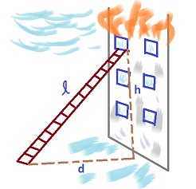
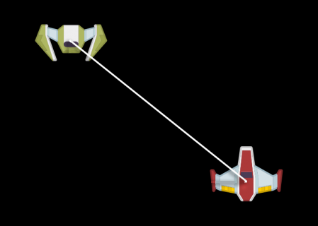
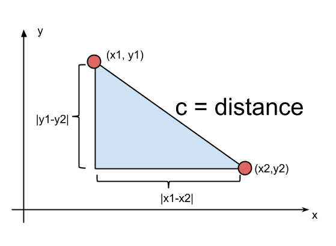

# Pitagorina teorema

Pitagorina teorema glasi:
```
a^2 + b^2 = c^2
```
gde su `a` i `b` kraće stranice trougla a `c` je hipotenuza.



Pitagorina teorema važi samo za pravougle trouglove.

# Primena

## Rastojanje između dve tačke

Često u programiranju želimo da znamo rastojanje između dve tačke na ekranu.



Najlakši način da to izračunamo je Pitagorina teorema.



Pravolinijska razdaljina između dve tačke se naziva Euklidskom razdaljinom. 

Primer u kodu:
```js
x = x1 - x2
y = y1 - y2
distance = Math.sqrt(a*a + b*b)
```

3D primer uključuje i `z` osu:

```js
x = x2 − x1
y = y2 − y1
z = z2 − z1
distance = Math.sqrt(x*x + y*y + z*z)
```
