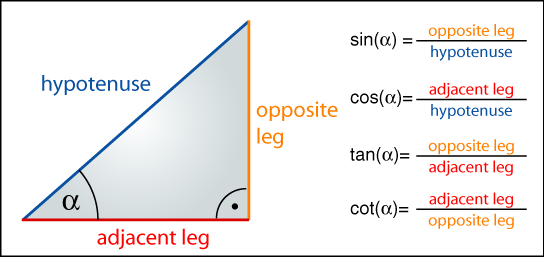
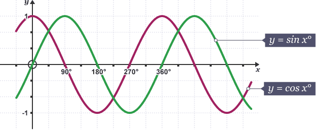
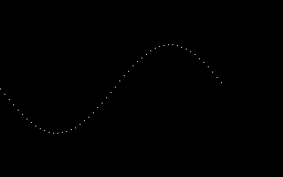
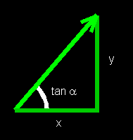
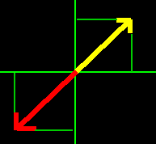

# Trigonometrijske funkcije

**Trigonometrijske funkcije povezuju ugao pravouglog trougla sa odnosom dužina dve stranice.** Mogu služiti za računanje nepoznatog ugla ili stranice trougla, a imaju i mnoge druge namene.

Koriste se i za krugove, jer oni imaju uglove, kao i neku vrtsu hipotenuze (poluprečnik). Ugao unutar kruga može iznositi bilo koju pozitivnu, pa čak i negativnu vrednost (za razliku od trougla).

Najpoznatije trigonometrijske funkcije su **sinus**, **kosinus** i **tangens**:

\[
\text{sinus}(\alpha) = \frac{\text{naspramna strana}}{\text{hipotenuza}}
\]
\[
\text{kosinus}(\alpha) = \frac{\text{priležeća strana}}{\text{hipotenuza}}
\]
\[
\text{tangens}(\alpha) = \frac{\text{naspramna}}{\text{priležeća strana}}
\]

Možemo ih pamtiti po engleskim skraćenicama SOH, CAH, TOA:

* **s**in(α) = **o**pposite / **h**ypotenuse
* **c**os(α) = **a**djacent / **h**ypotenuse
* **t**an(α) = **o**pposite / **a**djacent



Ove funkcije su ugrađene u digitrone i dostupne su u većini programskih jezika.

## Sinus i kosinus

`sin()` i `cos()` se mogu koristiti za razne stvari. Obe funkcije primaju jedan parametar, ugao, i vraćaju broj između -1 i 1. Ugao može biti beskonačne veličine, ali se sinusoidni obrazac ponavlja svakih 360°, što se zove osnovni period.



C program koji crta sinusnu funkciju za razne ulaze:

```c
void draw_sine ()
{
    int length = 50;
    fixed x, y;
    fixed angle = 0;
    fixed angle_stepsize = itofix (5);
    // Allegro degrees range from 0 to 255
    while (fixtoi(angle) < 256)
    {
        // the angle is plotted along the x-axis
        x = angle;
        // the sine function is plotted along the y-axis
        y = length * fsin (angle);

        putpixel (screen,
            fixtoi (x), fixtoi (y) + SCREEN_H / 2,
            makecol (255, 255, 255));

        angle += angle_stepsize;
    }
}
```



## Tangens

Tangens je funkcija za izračunavanje odnosa naspramne i priležeće strane trougla, koje su na slici označene sa `y` i `x`:

```
tan(α) = y / x
```



Tangens se može odrediti i ovako:

\[
\text{tan(α)} = \frac{\text{naspramna}}{\text{priležeća}} = \frac{\text{sin(α)}}{\text{cos(α)}}
\]

To znači da je tangens kombinacija sinus i kosinus funkcija. 

https://jsfiddle.net/mudroljub/c10hjzqe/

<script async src="//jsfiddle.net/mudroljub/c10hjzqe/embed/"></script>

# Inverzne trigonometrijske funkcije

**Inverzne trigonometrijske funkcije služe da izračunamo nepoznati ugao pravouglog trougla, na osnovu poznatih dužina dve stranice.**

## Arktangens

Inverzna funkcija tangensa zove se arktangens:

\[
\text{ugao} = \text{atan} \left( \frac{\text{naspramna}}{\text{priležeća strana}} \right)
\]

Ali ovo nekad može dati netačan rezultat, jer dva suprotna vektora imaju isti odnos dve stranice.



Delimično rešenje je moguće ovako (delimično jer ne proveravamo slučaj kada je x 0):

```js
if (x > 0)
    angle = atan(y / x)
else
    angle = PI + atan(y / x)
```

Ali da bi se stvari pojednostavile, funkcija `atan2()` je dostupna programerima:

```js
angle = atan2(y / x)
```
