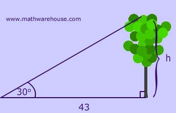
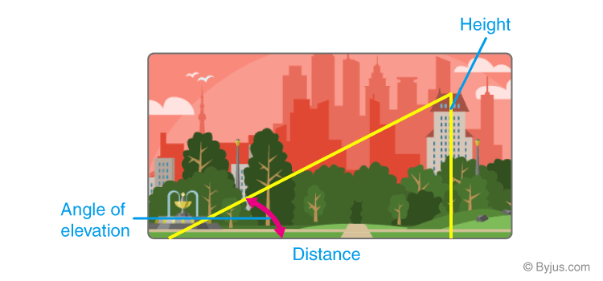
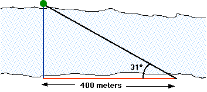
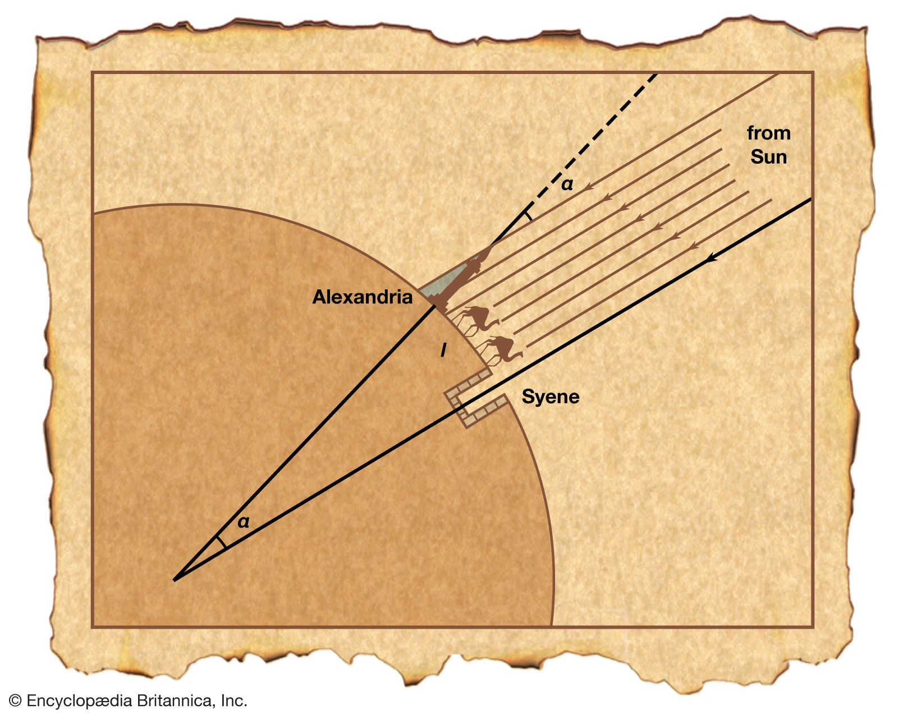

#  Primena trigonometrijskih funkcija

Trigonometrijske funkcije su posebno bitne za razvoj igara. Koriste se za računanje rastojanja i ugla ka nekom predmetu, računanje vektora, simulaciju fizike, modelovanje kružnog kretanja, talasa i drugih periodičnih pojava.

## Primena u stvarnom životu
### Računanje visina drveta

Bez merenja visine drveta, možemo je izračunati pomoću trigonometrije. Dovoljno je da izaberemo neku tačku, odokativno utvrdimo ugao ka vrhu drveta, i izmerimo rastojanje do podnožja.



Ovde nam može pomoći tangens funkcija:

\[
\tan(\alpha) = \frac{\text{visina}}{\text{rastojanje}}
\]

Pošto je visina nepoznata, menjamo mesta u jednačini:

\[
\text{visina} = \text{rastojanje} \times \tan(\alpha)
\]

Na isti način možemo saznati visinu zgrade i bilo kog drugog objekta: 



Tokom sunčanih dana, još je lakše izmeriti dužinu senke, koja predstavlja ležeću stranicu trougla.

### Računanje širine reke



### Računanje veličine Zemlje

Eratosten iz Kirene (3. vek p.n.e.) je prvi poznati naučnik koji je izračunao poluprečnik i obim planete Zemlje, koristeći trigonometriju.

Eratosten je znao da u podne letnje dugodnevnice Sunčevi zraci obasjavaju dno bunara u Sijeni. Izmerio je da u isto vreme u Aleksandriji sunčevi zraci padaju pod uglom 7°12', što je 1/50 kruga. Znajući da je rastojanje između tih mesta 805 kilometara,  je obim zemlje sa izuzetnom preciznošću (99,81%) u odnosu na savremenu vrednost.

Izmerivši obim, pomoću proste formule kruga je izračunao i poluprečnik naše planete.



### Računanje odnosa udaljenosti sunca i meseca


U nekom trenutku mesečeve mene, Aristarh je zaključio da Zemlja, Mesec i Sunce čine pravokutni trokut. Nakon što je izmerio jedan ugao gledajući sa zemlje, a drugi je bio 90 stepeni, treći je izračunao prostim oduzimanjem od zbira uglova u trouglu, koji uvek iznosi 180 stepeni.

Iako nije izmerio ni jedno rastojanje, pomoću trigonometrije je približno odredio odnos udaljenosti Sunca i Meseca i odnos njegovih veličina, na osnovu Zemljinog poluprečnika koji je izračunao njegov prethodnik.

Veličinu Meseca je dosta približno odredio, ali kod veličine Sunca je višestruko omanuo u odnosu na današnja merenja.

## Primena u programiranju

### Crtanje kruga

Pomoću trigonometrijskih funkcija možemo nacrtati krug:

```js
draw_circle () {
    const length = 50
    const angle_stepsize = 0.1
    let angle = 0.0

    while (angle < 2 * PI) {
      let x = length * cos(angle)
      let y = length * sin(angle)

      draw (x + SCREEN_W / 2, y + SCREEN_H / 2)
      angle += angle_stepsize
  }
}
```

### Kruženje nebeskih tela

Možemo koristiti sinus i kosinus za animaciju orbite planete:

```js
const canvas = document.getElementById('canvas')
const ctx = canvas.getContext('2d')

let angle = 0
const length_x = 100
const length_y = 100

function animate() {
  const x = canvas.width / 2 + length_x * Math.cos(angle)
  const y = canvas.height / 2 + length_y * Math.sin(angle)

  ctx.clearRect(0, 0, canvas.width, canvas.height)
  ctx.fillRect(x - 2, y - 2, 4, 4)

  angle += 0.05
  requestAnimationFrame(animate)
}

animate()
```
