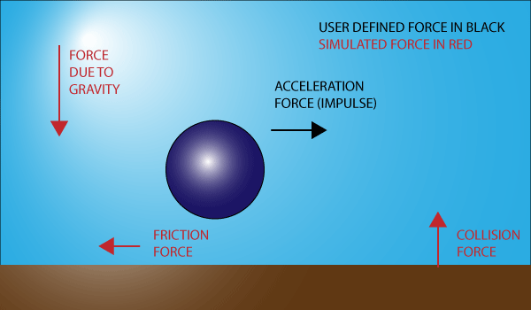

# Fizika

The great thing about modeling physics is this: if you model the forces correctly, you’ll get objects that behave realistically. Glavne sile prirode su gravitacija i otpor okruženja: trenje (po tlu) i vučenje (kroz vodu i vazduh).

Units of measure don’t matter in any physics calculation. All the formulas will work, as long as you are consistent.

A rigid body is a shape defined by the developer that is implicitly defined to be non-deformable.

https://gamedevelopment.tutsplus.com/articles/whats-in-a-projectile-physics-engine--cms-21584

https://gamedevelopment.tutsplus.com/series/how-to-create-a-custom-physics-engine--gamedev-12715
