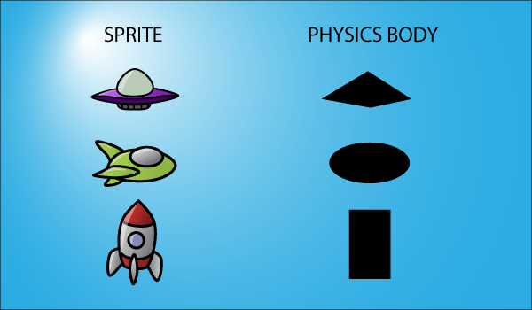
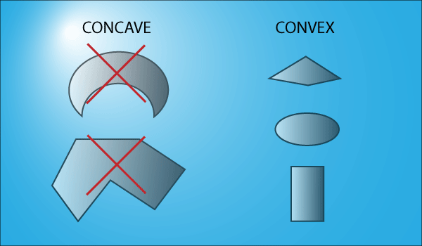
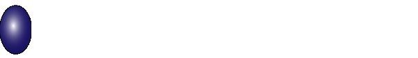

# Fizičko telo

Svaki fizički predmet ima prikačeno fizičko telo. Physics bodies are "simple" shapes that define the rough size and shape of your sprite.



A physics body is not predefined by the image of your sprite, and is typically invisible within the game. You create the shape by calling a method to draw the shape or by using a program to help you draw out. You then attach the body to the sprite, and gain access to the simulated effects and properties assigned to that body. You would likely want to make the physics body of the player a little smaller than the base sprite image.

You can have multiple physics bodies tied to a single sprite. Take, as an example, a sprite of a hero carrying a sword. It would make sense to create one body for the hero character, and another one for the sword he carries. This would allow you to create game logic based on collisions between different bodies.

U pseudokodu:
```java
function physicsCollisionDidOccur() {
  switch (collision) {
  case (Player && Sword):
    //do nothing;
    break;
  case (Player && Enemy):
    //ouch!!;
    break;
  case (Sword && Enemy):
    //do damage!!;
    break;
  }
}
```

## Ograničenja



Većina fizičkih pogona ima sledeća ograničenja:
* moraju se koristiti konveksni oblici (no interior angle is less than 180 degrees)
* primenjuje se samo fizika čvrstih tela

When a ball hits a wall, in the "real" world something like this will occur:



Your character's sprite can undergo this type of transformation, but its physics body cannot. You can control certain properties of the body to affect its "bounciness", but it cannot actually have a mutable shape. This is known as a Rigid Body, meaning that the body itself cannot be deformed or squished.

## Svojstva

Some of the most useful properties available on a typical physics body are:
* `Restitution` is a measure of how "bouncy" an object is. More formally, it's the measure of how much energy an object retains after it collides with another object.
* `Density` is the measure of how "heavy" an object is. It is used as a relative quality—for instance, a rock would be more dense than a ball, so when the ball hits the rock, it will be affected more heavily.
* `Friction` is the measure of how "slippery" an object is. This is used when one object is sliding along another, and determines how long will it take for it to stop.
* If a body is `dynamic`, then forces imposed upon it by the world and other objects will have an effect; if it is a `static` body, then they will not.
* `Rotation` is typically a Boolean variable that can be set on a physics body. In certain cases you may want to limit a body and not allow it to rotate, but you want forces to still be applied to that object.
