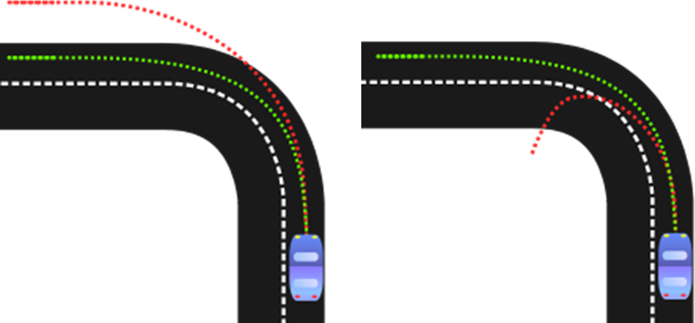

### Kola

When a car drives down a road, it experiences two main components of resistance that try to slow it down. The first is aerodynamic drag, and the second is rolling resistance. The total resistance felt by the car is the sum of these two components:
```
R total = R air + R rolling
```

#### Stopping Distance

Under normal conditions, stopping distance is a function of the braking system and how hard the driver applies the brakes: the harder the brakes are applied, the shorter the stopping distance. That’s not the case when the tires start to skid. Under skidding conditions, stopping distance is a function of the frictional force that develops between the tires and the road, in addition to the inclination of the roadway.

There’s a simple formula that considers these factors that you can use to calculate skidding distance:
```
ds = V2 / [2g (μ cos φ + sin φ)]
```

`ds` is the skidding distance, `g` the acceleration due to gravity, `μ` the coefficient of friction between the tires and road, `V` the initial speed of the car, and `φ` the inclination of the roadway (positive angle means uphill and a negative downhill).

The coefficient of friction will vary depending on the condition of the tires and surface of the road, but for rubber on pavement the dynamic friction coefficient is typically around 0.4.

#### Skretanje

For a car to maintain its curved path, there must be a centripetal force (“center seeking” in Greek) that acts on the car. When riding in a turning car, you feel a centrifugal acceleration, directed away from the center. This acceleration is really a result of inertia, the tendency of your body and the car to continue on their original path, and is not a real force acting on the car. The real force is the centripetal force, and without it your car would continue on its straight path and not along the curve.

When you turn the hand wheel in a car, the tires produce a centripetal force toward the center of the curve via friction with the surface of the road.

One of the most important aspects of racing is taking turns as fast as possible but without losing control.



If the front wheels slide, the car understeers and the arc is larger than the driver intended. This is commonly caused by traveling too fast through a corner and trying to take the corner too tightly. However, if the driver breaks hard or even just lets off the gas, there will be a weight shift forward. This causes the car to turn more than the driver intended, and can even result in a spin.
