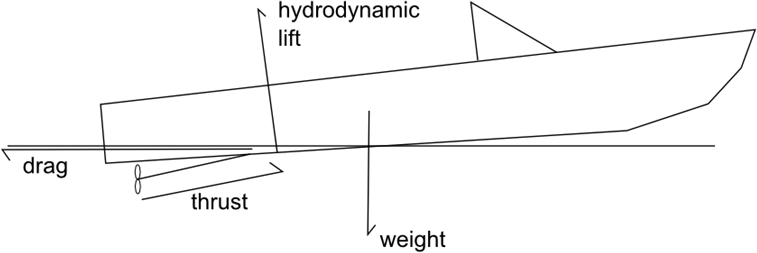
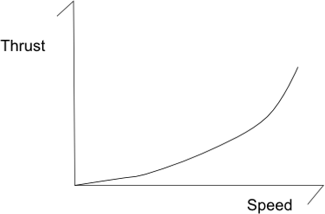

### Brod (plovilo)

There are many ways to classify ships and boats, but in regards to the physics governing them, there are three basic types. Displacement vessels, semi-displacement vessels, and planing vessels are named after the forces that keep the boat afloat while it is at cruising speed.

When not moving, all vessels are in displacement mode. The term displacement in this context means that the ship is supported solely by buoyancy. The word displacement itself refers to the volume of water “pushed” out of the way by the ship as it sits floating in the water.

A planing vessel is one that is not supported by buoyancy, but by hydrodynamic lift. This includes the most everyday speedboats. When the boat begins traveling at high speed, the force of the water hitting the bottom of the boat causes the boat to rise up. This is known as planing, and it greatly reduces the resistance.

Semi-displacement vessels are those that straddle the two categories, with some support coming from buoyancy and some coming from planing forces.

As you can see, compared to when the boat is at rest, very little of the hull is in the water now. This reduces the wetted surface area and skin friction, and allows the craft to go faster, generating more lift and reducing the skin friction yet again.

There are a variety of methods to propel a boat through the water. The oldest is by way of sails using the wind. There are many different kinds of propulsion: rudders, shafted fixed-pitch propellers, shafted CPP propellers, azimuthing thrusters, propellers in nozzles, water jets, pump jets, contra-rotating, and the very odd Voith Schneider type.

The major propulsion relationship for your simulation would be the thrust-to-propeller RPM or thrust-to-throttle curve. As the boat moves faster through the water, the inflow velocity of the water into the propeller is higher. This means that the difference between the velocity of the intake and the velocity of the output is smaller, reducing the amount of thrust.

#### Potapanje broda

If you have boats in your video game, the first step to making them realistic physically is allowing them to sink if they become damaged.

Most boats are least stable about their longitudinal axis — that is, they are easier to heel port and starboard than they are to flip end over end. One of the most famous examples of a sinking ship, the Titanic, shows that when a boat is sinking from damage, it can sink end over end.

Archimedes’s principle states that the weight of an object floating in a fluid is equal to the weight of the volume of fluid displaced by the object. It says that a ship of a given weight must have sufficient volume to displace enough water, an amount equal to the weight of the ship, in order for it to float.

Boats protect their stability by compartmentalizing the hull into several watertight compartments. This way, if the side of a vessel hits an iceberg, only the compartment damaged will flood with seawater. If enough compartments are damaged, the vessel will not have enough buoyancy to support its weight and it will sink.

In general, you want to follow a few high-level rules:
• The higher the center of gravity, the more likely it is that the boat will tip over.
• Large vessels are always compartmentalized. Damage should be limited to the watertight compartment in which it occurred.
• The vessel will heal or trim in the direction of damage. If damage occurs on the starboard side, the boat will heel to starboard. If the damage occurs in the bow, the boat will list forward.
• A boat will remain floating as long as the undamaged compartments have a volume in cubic meters of at least the weight of the hull in metric tons divided by 1.025.
• After being damaged, even if a vessel has enough undamaged volume to remain afloat, it doesn’t necessarily mean it will float upright.
• Sinking almost never occurs as quickly as depicted in video games; however, capsizing can occur rapidly and is probably a more realistic way to model a stability failure.
