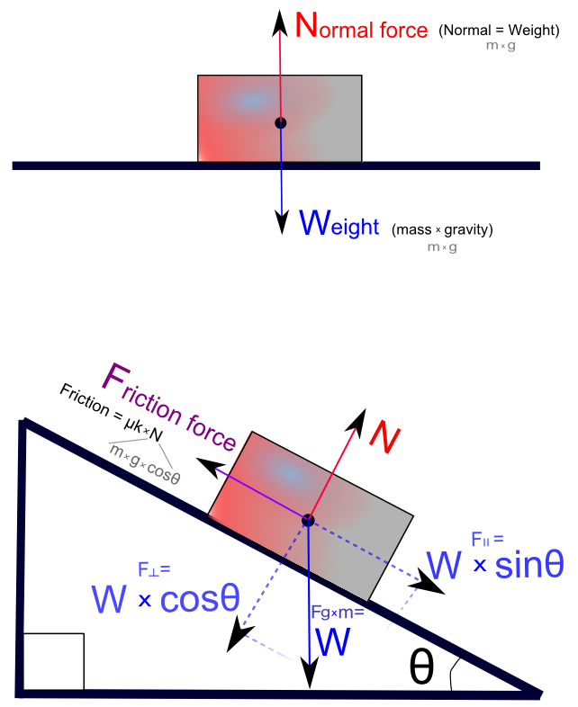

# Sile

Gravitacija i otpor okruženja: trenje (po tlu) i vučenje (kroz vodu i vazduh).

## Trenje (friction)

Friction resist motion due to the interaction between contacting surfaces. Thus, it is a contact force. The magnitude of the friction is a function of the normal force between the contacting surfaces and the surface roughness.


There are two types of friction: static and kinetic. Static friction is the force that keeps an object from moving initially, and kinetic friction is the force that slows down an object after it gets moving. Oddly enough, friction changes drastically in these two conditions. This is why it’s so hard to regain control of a car once it’s in a skid — the dynamic friction is lower than the static friction. Always calculate static friction first. If all the other forces added up are less than the static friction, the object will not move. As soon as the other forces become greater than the static friction, the object starts to move, and kinetic friction takes over.

The friction between two objects has everything to do with what those objects are made of. When you calculate friction, you need a table of coefficients. The coefficient of friction is ratio of the force required to move an object over the normal force. The Greek letter μ (mu) is the standard symbol for the coefficient of friction.


Static friction:
```
FS = –μS * N
```
Kinetic friction:
```
FK = –μK * N
```
Note that the frictional force is always the opposite direction of the normal force (N) of the surface.

## Vuča (drag) ili aerodinamički otpor

Vuča (otpor vazduha i fluida) se opire kretanju kao trenje. In fact, a major component of fluid resistance is friction that results from the contact of the fluid with the body’s surface.

Wind resistance, a type of drag, is the relative opposing force imparted on an object as it moves against still air.

## Teža (gravitacija)


Think of gravity as a constant force always pulling down a small amount every frame. Whenever we looked at the vertical components of the motion, we used `–g` for the acceleration. You can use that gravitational constant to calculate the force due to gravity, weight. Weight is actually a vector force, and its direction is always down toward the center of the earth. The magnitude of weight is the object's mass times the acceleration due to gravity:
```
w = mg
```

Even though we tend to use mass and weight interchangeably in everyday language, in physics they are two very different quantities. Mass is a scalar, weight is a vector. Mass is measured in kilograms, weight is measured in newtons. Weight can change if the gravity changes. For example, gravity on the moon is 1/6 as strong as it is on Earth. The mass always stays the same no matter where the object is.

If mass is measured in kilograms, when you multiply it by the acceleration due to gravity (g = –9.8m/s 2 ), you end up with the unit of kg*m/s^2. This unit is quite awkward to say, so it has been named the Newton (N).
```
1N = 1kg * m/s^2
```
At sea level, Earth’s gravity causes an acceleration of exactly `9.80665 meters/s^2` on every object. Thus, a one kilogram object exerts a force of 9.80665N.

Galileo discovered an interesting property about the acceleration due to gravity, by dropping things from the Leaning Tower of Pisa: It doesn’t matter how much something weighs because they all fall at the same rate, excepting any large differences in air resistance. More massive objects exert a greater gravitational force, but this force is used to accelerate the larger mass, therefore the acceleration remains the same.

## Normalna sila (Normal force)

Have you ever wondered why, if gravity is always pulling you down, you don't perpetually fall? Something is stopping you from falling all the way to the Earth's core. The ground actually exerts a force on you as well. The normal force is the force of the surface your object is sitting on, that counteracts gravity. It's called the normal force because this force is always perpendicular (normal) to the surface the object is on.

Weight is always a negative value, because the direction is down toward the center of the Earth. That is why the normal force must always have a positive value.


