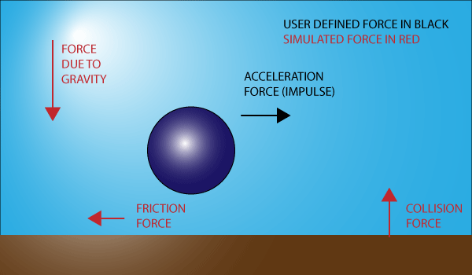

# Sile

The great thing about modeling physics is this: if you model the forces correctly, you’ll get objects that behave realistically. Glavne sile prirode su gravitacija i otpor okruženja: trenje (po tlu) i vučenje (kroz vodu i vazduh).



In a simulated physics world, bodies are moved by the application of forces and impulses. Forces typically affect bodies more gradually than impulses. They are constantly applied over time (like gravity or an engine). Impulses are immediately-applied adjustments to a body's momentum, usually on user input.

## Merne jedinice

Units of measure don’t matter in any physics calculation. All the formulas will work, as long as you are consistent.

Force is measured in Newtons. If mass is measured in kilograms, when you multiply it by the acceleration (`m/s^2`), you end up with the unit of `kg*m/s^2`. This unit has been named the Newton (`N`). One Newton is the force required to accelerate one kilogram at a rate of one meter per second squared:
```
1N = 1kg * m/s^2
```
