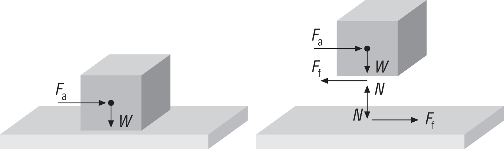
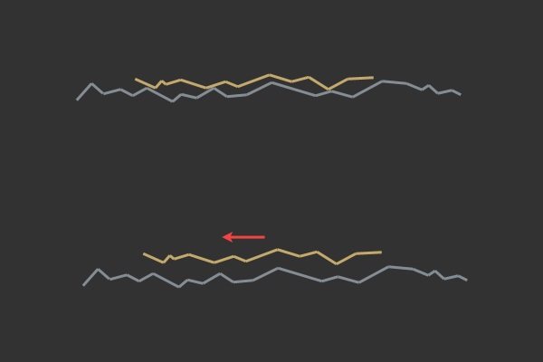
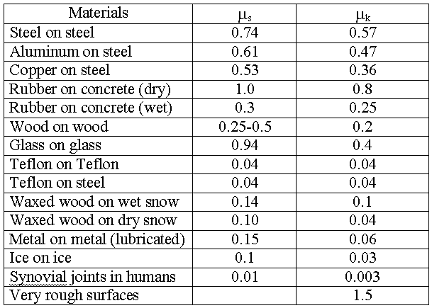

# Trenje (*friction*)

Friction always applies a force upon objects in the direction opposite to the motion in which they are to travel.

Friction resist motion due to the interaction between contacting surfaces. Thus, it is a contact force. The magnitude of the friction is a function of the normal force between the contacting surfaces and the surface roughness.



Razlikuju se trenje mirovanja (statičko) i trenje kretanja (kinetičko). Static friction is the force that keeps an object from moving initially, and kinetic friction is the force that slows down an object after it gets moving. Na mikro nivou to izgleda ovako:



Friction changes drastically in these two conditions. This is why it’s so hard to regain control of a car once it’s in a skid — the dynamic friction is lower than the static friction. Always calculate static friction first. If all the other forces added up are less than the static friction, the object will not move. As soon as the other forces become greater than the static friction, the object starts to move, and kinetic friction takes over.

The friction between two objects has everything to do with what those objects are made of. When you calculate friction, you need a table of coefficients. The Greek letter μ (mu) is the standard symbol for the coefficient of friction.



The coefficient of friction is ratio of the force required to move an object over the normal force.

Merna jedinica trenja je njutn (N).

## Trenje mirovanja (*statičko trenje*)

```
FS = –μS * N
```

## Trenje kretanja (*kinetičko trenje*)

Trenje kretanja može biti trenje klizanja, trenje kotrljanja i otpor fluida.

```
FK = –μK * N
```

Sila trenja je uvek suprotnog smera na normalnu silu površine.

### Otpor fluida

Vuča (*drag*) ili aerodinamički otpor se opire kretanju tela kroz vodu i vazduh. Glavni sastojak otpora fluida je trenje izazvano dodirom fluida i površine tela.

Wind resistance, a type of drag, is the relative opposing force imparted on an object as it moves against still air.
