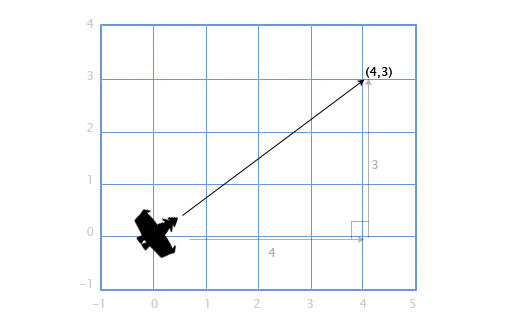
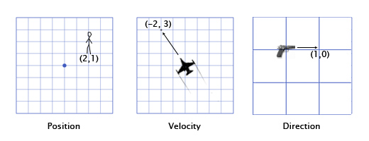

# Vektori

Vektori su ušli u nauku u 19. veku, kada su matematičari i fizičari nastojali da opišu kretanje, umesto statičnog sveta. Vektore i matrice proučava linearna algebra.

U programiranju, vektor je niz brojeva kojima zapisujemo dužinu i smer. Vektor možemo vizuelizovati kao duž koja ima glavu i rep. Dužina vektora se naziva intenzitet.


## Zapisivanje vektora

Vektore možemo zapisati u polarnim ili Dekartovim koordinatama. 

**Polarnim načinom** zapisujemo dužinu i smer vektora, na primer `[5, 0.93]`:

```
duzina = 5
smer = 0.93 radijana (ili ~53.3 stepeni)
```

**Kartezijanskim načinom** zapisujemo pomeraj vektora po osama (x, y, i eventualno z), na primer `[4, 3]`:

```
pomeraj_x = 4
pomeraj_y = 3
```

## Prevođenje polarnog u kartezijanski zapis

Iz polarnog zapisa lako možemo dobiti `x` i `y` komponentu vektora. Koristimo `cos()` funkciju za računanje `x`, a `sin()` za `y`. Obe funkcije primaju ugao, a vraćaju broj između -1 i 1. Kada pomnožimo taj broj sa dužinom vektora, dobijemo odgovarajuću komponentu:

```
pomeraj_x = duzina * cos(ugao)
pomeraj_y = duzina * sin(ugao)
```

## Računanje dužine vektora

S druge strane, ako imamo vektor pomeraja (x, y), dužinu možemo računati Pitagorinom teoremom.



Na primer, ako se nepoznati leteći objekat pomera 4 nadesno i 3 nagore, ovako ćemo saznati njegovu brzinu:

\(
\text{brzina}^2 = 3^2 + 4^2
\)
\(
\text{brzina}^2 = 9 + 16
\)
\(
\text{brzina}^2 = 25
\)
\(
\text{brzina} = \sqrt{25}
\)
\(
\text{brzina} = 5
\)

## Vektori u igrama

U programiranju igara, vektori su nezaobilazni. **Koriste se za čuvanje položaja, brzine, smera**. Ovo su neki 2D primeri:



Vektor položaja znači da čikica stoji 2 metra istočno i jedan metar severno od ishodišta. Vektor brzine pokazuje da u jednom minutu avion ide 3 kilometra gore i 2 levo. Vektor smera pokazuje da je pištolj uperen udesno. Kao što vidimo, vektor je samo skup brojeva, čije značenje zavisi od konteksta. Zbog toga je bitno da vodimo računa o jedinicama. Na primer, da položaj uvek bude u metrima, a brzina u metrima po sekund.

## Predstavljanje vektora

U programskim jezicima uglavnom ne postoji ugrađeni tip za čuvanje vektora. Vektori se čuvaju u strukturama poput niza ili specijalizovane klase. Ovo je prost primer Vektor klase, koja prime dve (`x, y`) i opciono treću (`z`) dimenziju:

```js
class Vektor {
  constructor(x, y, z = 0) {
    this.x = x
    this.y = y
    this.z = z
  }
}
```

Da bismo počeli da radimo sa vektorima, prvo što treba napraviti je prosta vektor klasa koja radi vektorsko sabiranje, oduzimanje, razne vrste množenja i rotaciju. Ostatak naše fizike će biti izgrađen na vektorima.

## Vektori vs skalari

U kontekstu vektora, obične brojeve zovemo skalarima. Skalar je svaka veličina koja može biti izražena pomoću jednog broja (temperatura, dužina, masa...). Zove se skalar jer skalira vektor.

Razlika između vektora i skalara je u smeru. Ako kažeš prijatelju da te pokupi kolima, jer se nalaziš 2 km od njega, po svoj prilici te neće naći. Ali, ako mu kažeš da si 2 km južno, onda ima šanse da te pokupi. To je jedina razlika.
