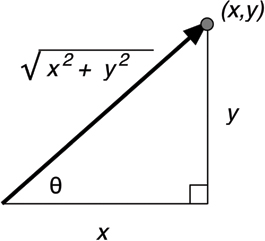

# Vektori

Vektori su ušli u nauku u 19. veku, kada su matematičari i fizičari nastojali da opišu kretanje, umesto statičnog sveta. Vektore i matrice proučava linearna algebra.

U programiranju, vektor je niz brojeva kojima zapisujemo dužinu i smer. Vektor možemo vizuelizovati kao duž koja ima glavu i rep. Dužina vektora se naziva intenzitet.


Obrtanje smera vektora je veoma jednostavno. Samo zamenimo glavu i rep, tj. obrnemo dve koordinate.

## Zapisivanje vektora

Vektore možemo zapisati u polarnim ili Dekartovim koordinatama. Polarnim zapisom čuvamo dužinu i smer vektora:
```
duzina = 5
smer = PI/4 (45 stepeni)
```

Kartezijanskim zapisom čuvamo pomeraj vektora po osama (x, y, i evenualno z):
```
duzina_x = 3.53
duzina_y = 3.53
```

Iz polarnog zapisa lako možemo dobiti `x` i `y` komponentu vektora. Za računanje `x` komponente koristimo `kosinus()` funkciju, a za `y` komponentu `sinus()`. Obe funkcije primaju ugao, a vraćaju broj između -1 i 1. Kada pomnožimo taj broj sa dužinom vektora, dobijemo odgovarajuću komponentu:

```
duzina_x = duzina * cos(ugao);
duzina_y = duzina * sin(ugao);
```

S druge strane, ako imamo x i y komponentu vektora, dužinu možemo računati Pitagorinom teoremom.



## Vektori u igrama

U programiranju igara, vektori su nezaobilazni. Koriste se za čuvanje položaja, smera, brzine. Ovo su neki 2D primeri:


Vektor položaja znači da čikica stoji 2 metra istočno i jedan metar severno od ishodišta. Vektor brzine pokazuje da u jednom minutu avion ide 3 kilometra gore i 2 levo. Vektor smera pokazuje da je pištolj uperen udesno. Kao što vidimo, vektor je samo skup brojeva, čije značenje zavisi od konteksta. Zbog toga je bitno da vodimo računa o jedinicama. In some games, positions are always given in meters, and velocities in meters per second.

Ne postoji ugrađeni tip za čuvanje vektora. Vektori se obično čuvaju u strukturama poput niza ili specijalizovane klase. Ovo je prost primer Vektor klase, koja opciono prima treću (`z`) dimenziju:

```js
class Vektor {
  constructor(x, y, z = 0) {
    this.x = x
    this.y = y
    this.z = z
  }
}
```

Prvo što treba napraviti je prosta vektor klasa koja radi vektorsko sabiranje, oduzimanje, razne vrste množenja (dot product, cross product) i rotaciju. Ostatak naše fizike će bit izgrađen na vektorima.

Ukratko, postanite komotni sa vektorima.

# Skalari

U kontekstu vektora, običan broj zovemo skalar. Skalar je svaka veličina koja može biti izražena pomoću jednog broja (temperatura, dužina, masa...). Zove se skalar jer skalira vektor.

Razlika između vektora i skalara je u smeru. For example, your friend calls and asks you to come pick him up because he's only 2 miles away. You say no problem and hop in your car. But how will you find him? If he had said 2 miles due east, you could find him. To je razlika između vektora i skalara.

http://alfonse.bitbucket.org/oldtut/Basics/Introduction.html
