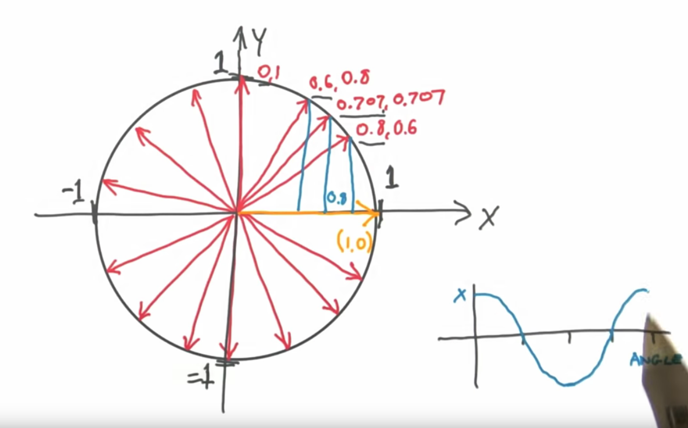

# Vektori

Vektor je niz dva ili tri broja kojima označavamo dužinu i smer. Vektor možemo vizuelizovati kao duž koja ima glavu i rep. Dužina vektora se naziva intenzitet.


Možemo koristiti Pitagorinu teoremu za računanje dužine vektora.


Vectors entered math in the 19 century, as mathematicians and physicists wrestled to describe motion, rather than static position. Vektore i matrice proučava linearna algebra.

## Vektori u igrama

U programiranju igara, vektori su nezaobilazni. Koriste se za čuvanje položaja, smera, brzine. Ovo su neki 2D primeri:


Vektor položaja znači da čikica stoji 2 metra istočno i jedan metar severno od ishodišta. Vektor brzine pokazuje da u jednom minutu avion ide 3 kilometra gore i 2 levo. Vektor smera pokazuje da je pištolj uperen udesno. Kao što vidimo, vektor je samo skup brojeva, čije značenje zavisi od konteksta. Zbog toga je bitno da vodimo računa o jedinicama. In some games, positions are always given in meters, and velocities in meters per second.

Ne postoji ugrađeni tip za čuvanje vektora. Vektori se obično čuvaju u strukturama poput niza ili specijalizovane klase. Ovo je prost primer Vektor klase, koja opciono prima treću (`z`) dimenziju:

```js
class Vektor {
  constructor(x, y, z = 0) {
    this.x = x
    this.y = y
    this.z = z
  }
}
```

Prvo što treba napraviti je prosta vektor klasa koja radi vektorsko sabiranje, oduzimanje, razne vrste množenja (dot product, cross product) i rotaciju. Ostatak naše fizike će bit izgrađen na vektorima.

Ukratko, postanite komotni sa vektorima.

## Skalari

U kontekstu vektora, običan broj nazivamo skalar. Skalar je svaka veličina koja može biti merena pomoću jednog broja (temperatura, dužina, masa...). Zove se skalar jer skalira vektor.

Razlika između vektora i skalara je u smeru.

For example, suppose your friend is having car trouble, and he calls and asks you to come pick him up because he's only 2 miles away. You say no problem and hop in your car. But how will you find him? If he had said 2 miles due east on your street, you might have had a better chance of locating him. That's the difference between vectors and scalars.

## Coordinate system

In one dimension there are only two possible directions, positive or negative. In 2D, positive or negative isn't enough.

There are two ways for describing a vector in 2D: polar coordinates and Cartesian coordinates. Polar coordinates describe its length and direction, Cartesian coordinates describe its horizontal and vertical displacement.

## Normal Vectors

A vector is said to be normal to a surface if it is perpendicular to it. Be careful not to confuse the term “normalization” with the term “normal vector.”

## Vector unit circle

Dot proizvod dva normalizovana 2D vektora od kojih je jedan jedinični vektor (1, 0) je uvek x komponenta drugog. Na primer:
```
(0.8, 0.6) * (1, 0) = 0.8 * 1 + 0.6 * 0 = 0.8 + 0 = 0.8
```

Na kraju dobijamo neku vrstu jediničnog kruga, gde je dot proizvod zapravo kosinus.



## Direction Inversion

Geometrically, direction Inversion of the vector is very simple. Just switch the tail and the head.

If you think of vectors in terms of Cartesian coordinates, inverting is a simple matter of swapping the two coordinates.

## Trigonometrijske funkcije

The sine can be used to calculate the y-coordinate of a vector, and the cosine can be used to calculate the x-coordinate. The sin() and cos() functions take the angle, and return a number between -1 and 1. If you multiply this number by the length of the vector, you will get the exact Cartesian coordinates of the vector:
```
speed_x = speed * cos(angle);
speed_y = speed * sin(angle);
```

http://alfonse.bitbucket.org/oldtut/Basics/Introduction.html
