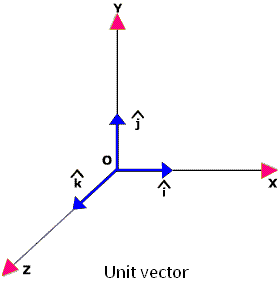

# Jedinični vektor

Jedinični vektor je vektor dužine 1. Možemo normalizovati svaki vektor u jedinični vektor. 

## Normalizacija vektora

Da bismo normalizovali vektor, podelimo svaku njegovu komponentu sa dužinom vektora:

\[
\text{jedinični vektor} = \left( \frac{\text{vektor.x}}{\text{dužina vektora}}, \frac{\text{vektor.y}}{\text{dužina vektora}}, \frac{\text{vektor.z}}{\text{dužina vektora}} \right)
\]

Dužina vektora \(|\vec{v}|\) se izračunava primenom Pitagorine teoreme, odnosno njenim  proširenjem na 3D:

\[
|\vec{v}| = \sqrt{x^2 + y^2 + z^2}
\]

Na primer, da bismo normalizovali vektor (3, 4), prvo računamo dužinu:

\[
|\vec{v}| = \sqrt{3^2 + 4^2} = \sqrt{9 + 16} = \sqrt{25} = 5
\]

Potom delimo svaku komponentu njegovom dužinom i dobijamo:

\[
\hat{v} = \left( \frac{3}{5}, \frac{4}{5} \right)
\]

Kod jediničnog vektora, osovine se često označavaju kao:
- x osa se naziva `i`
- y osa se naziva `j`
- z osa se naziva `k`

## Upotreba u igrama

U igrama, kada radimo sa smerovima (nasuprot položaja i brzina), bitno je koristiti jedinične vektore. 

Na primer, top uperen u smeru (1,0), dakle udesno, ispaljuje projektil pri brzini 20 m/s. Koja je vektorska brzina projektila? Jednostavno pomnožimo taj jedinični vektor i brzinu projektila da dobijemo vektorsku brzinu: 

\[
\vec{v} = (1, 0) \cdot 20 = (20, 0)
\]

dakle projektil leti 20 m/s udesno.

## Normalni vektori

Vektori su normalni u odnosu na površinu kada su pod pravim uglom. Normalni vektori nemaju nikakve veze sa normalizacijom vektora.
