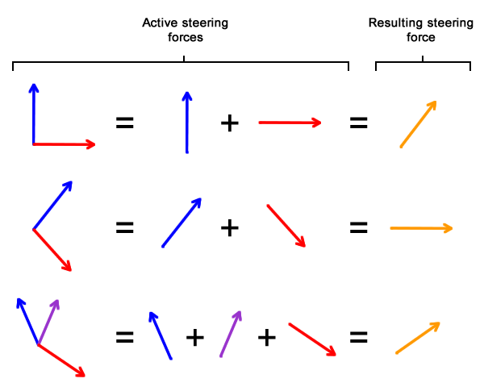
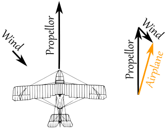
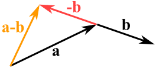

# Sabiranje i oduzimanje vektora

Vektori se mogu sabirati i oduzimati prema pravilima linearne algebre.

## Sabiranje vektora

Vektore sabiramo tako što im saberemo svaku dimenziju ponaosob. Sabiranje 2D vektora:
```
a + b = [(a.x + b.x), (a.y + b.y)]
```

Sabiranje 3D vektora je identično, samo dodamo još jednu dimenziju:

```
a + b = [(a.x + b.x), (a.y + b.y), (a.z + b.z)]
```

Ovako izgleda sabiranje 2d vektora sa pravim brojevima:

```
[0, 1] + [3, -2] = [(0 + 3), (1 - 2)] 
                 = [3, -1]
```

U kodu:
```js
const saberi = (v1, v2) => {
  return {
    x: v1.x + v2.x,
    y: v1.y + v2.y,
    z: v1.z + v2.z,
  }
}
```

### Sabiranje vektora u igrama

U igrama, primer sabiranja vektora je implementacija fizike. Svaki fizički predmet obično ima vektore za položaj, brzinu i ubrzanje. Za svaki kadar, treba da integrišemo te vektore, tj. da dodamo brzinu položaju, i ubrzanje brzini.

Uzmimo na primer Super Marija koji skače. Njegova početna brzina skoka je (1,3), a ubrzanje (0,-1), jer ga gravitacija vuče naniže. Evo kako izgleda njegov skok tokom 8 kadrova:


Kao što vidimo, u svakom kadru se dodaje gravitacija (-1) na njegovu vertikalnu brzinu. Obično igrač dodaje ubrzanje, a igra računa brzinu i položaj sabiranjem vektora.

### Sabiranje vektora kao pomeraj

Možete zamišljati sabiranje vektora kao pomeraj na mapi. Ako putujete duž vektora `v`, a zatim skrenete i pratite vektor `w`, zapravo idete od početka `v` do kraja `w`.


### Sabiranje sila

Sabiranjem vektora izračunavamo ukupnu silu (rezultantu) koja deluje na neki predmet:



Primer sabiranja sila koje deluju na avion:



## Oduzimanje vektora

Možemo i oduzimati jedan vektor od drugog:

- prvo obrnemo pravac vektora (b) koji želimo da oduzmemo
- zatim ih sabiramo



Oduzimanje vektora `a - b` nije ništa drugo nego sabiranje  `a` i `–b`:

```
a - b = [(a.x - b.x), (a.y - b.y), (a.z - b.z)]
```

### Oduzimanje vektora u igrama

Oduzimanje vektora je korisno za dobijanje vektora pomaka, koji vodi od jedne pozicije do druge. Da bismo to izračunali, oduzimamo početnu tačku od krajnje tačke.

Na primer, igrač sa laserskom puškom stoji na poziciji (1,2), a neprijateljski robot na (4,3). Da dobijemo vektor kojim laser pogađa robota, oduzimamo poziciju igrača od pozicije robota:

```
(4, 3) - (1, 2) = (4-1, 3-2) = (3, 1)
```


### Implementacija prateće rakete

Recimo da pišemo igru u kojoj igrač može ispaljivati prateće rakete. Prvo računamo vektor razdaljine, tako što oduzmemo položaj rakete od položaja cilja:

```js
razdaljina.x = target.x − raketa.x
razdaljina.y = target.y − raketa.y
```

Sada možemo izračunati ugao pod kojim raketa treba da ide, pomoću trigonometrijske funkcije `atan2()`:

```js
ugao = atan2(razdaljina.y, razdaljina.x)
```

Ukoliko želimo da raketa prati cilj i nakon lansiranja, potrebno je povremeno ažurirati ovaj ugao.