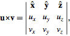

## Množenje vektora i skalara (skaliranje vektora)

When you multiply a scalar by the vector, you're actually scaling its magnitude, while leaving its direction unchanged.

Multiplication of a vector `a` by a scalar `s` is accomplished by multiplying the individual components of `a` by `s`:
```
s * a = ( s * ax, s * ay, s * az)
```

U kodu:
```js
function skaliraj(vektor, skalar) {
  return {
    x: vektor.x * skalar,
    y: vektor.y * skalar,
    z: vektor.z * skalar
  }
}
```

In games, it is often useful to multiply a vector by a scalar. For example, we can simulate air resistance by multiplying the player's velocity by 0.9 every frame.

## Skalarni proizvod vektora (*dot product*)

Skalarni proizvod vektora (engleski *dot product*, jer se piše pomoću tačke) is an operation that, given two vectors, returns a floating-point value. It is usually depicted as:
```
u • v
```
It is computed as follows:
```
ux * vx + uy * vy + uz * vz
```

When applied to unit vectors, the dot product can be interpreted as the cosine of the angle between the two vectors being multiplied. Thus, the dot product of two parallel vectors equals one, and the dot product of two perpendicular vectors equals zero.

Seems kind of useless at first, but lets look at examples:


We see, when the vectors are pointing the same direction, the dot product is positive. When they are perpendicular, the dot product is zero, and when they point in opposite directions, it is negative. Basically, it is proportional to how much the vectors are pointing in the same direction.

Let's say we have a guard at position G (1,3) facing in the direction D (1,1), with a 180 field of view. We have a hero sneaking by at position H (3,2). Is he in the guard's field of view? We can find out by checking the sign of the dotproduct of D and V (vector from the guard to the hero):
```
V = H-G = (3,2)-(1,3) = (3-1,2-3) = (2,-1)
D•V = (1,1)•(2,-1) = 1*2+1*-1 = 2-1 = 1
```
Since 1 is positive, the hero is in the guard's field of view!

## Vektorski proizvod (*cross product*)

Vektorski proizvod (engleski *cross product*, jer se piše pomoću krstića tj. `x`) is an operation that, given two vectors, returns a third vector:
```
u * v
[uy*vz - uz*vy, uz*vx - ux*vz, ux*vy - uy*vx]
```
But notice how cross products are more expensive to compute than the dot version.



Let's say you have a boat that has cannons that fire to the left and right. Given that the boat is facing along the direction vector (2,1), in which directions do the cannons fire? This is easy in 2D: to rotate 90 degrees clockwise, just flip the two vector components, and then switch the sign of the second component. (a,b) becomes (b,-a). So, if the boat is facing along (2,1), the right-facing cannons fire towards (1,-2). The left-facing cannons fire in the opposite direction, so we flip both signs to get: (-1,2).


So, what if we want to do this in 3D? Let's revisit our sailing ship. We have a vector for the direction of the mast M, going straight up (0,1,0), and the direction of the north-north-east wind W (1,0,2), and we want to find the direction the sail S should stick out in order to best catch the wind. The sail has to be perpendicular to the mast, and also perpendicular to the wind. To solve this, we can use the cross product: S = M x W.


The cross product of A(a1,a2,a3)) and B(b1,b2,b3)) is:
(a2b3-a3b2, a3b1-a1b3, a1b2-a2b1)

So now we can plug in our numbers and solve our problem:

S = MxW = (0,1,0)x(1,0,2) = ([1*2-0*0], [0*1-0*2], [0*0-1*1]) = (2,0,-1)

This is pretty ugly to do by hand. For most graphics and game work I would recommend just encapsulating it in a function like the one below, and never thinking about the details again.

```java
vec3 cross(vec3 a, vec3 b) {
    vec3 result;
    result[0] = a[1] * b[2] - a[2] * b[1];
    result[1] = a[2] * b[0] - a[0] * b[2];
    result[2] = a[0] * b[1] - a[1] * b[0];
    return result;
}
```

## 2D vektorski proizvod (*cross product*)

The 2D cross product, unlike the 3D version, does not return a vector but a scalar. This scalar value actually represents the magnitude of the orthogonal vector along the z-axis, if the cross product were to actually be performed in 3D. In a way, the 2D cross product is just a simplified version of the 3D cross product. But, the order of operations is important: a×b is not the same as b×a.

Two vectors can be crossed, a scalar can be crossed with a vector, and a vector can be crossed with a scalar. Here are the operations:

```cpp
// Two crossed vectors return a scalar
float CrossProduct(const Vec2& a, const Vec2& b)
{
  return a.x * b.y - a.y * b.x;
}

// cross product with a vector a and scalar s, both returning a vector
Vec2 CrossProduct(const Vec2& a, float s)
{
  return Vec2( s * a.y, -s * a.x );
}

Vec2 CrossProduct(float s, const Vec2& a)
{
  return Vec2( -s * a.y, s * a.x );
}
```

http://gafferongames.com/game-physics/physics-in-3d/
