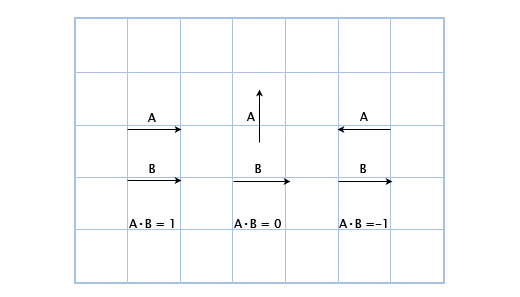
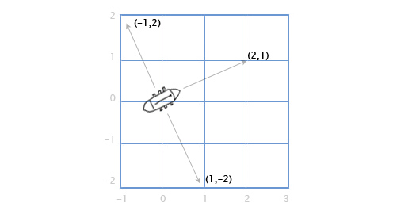
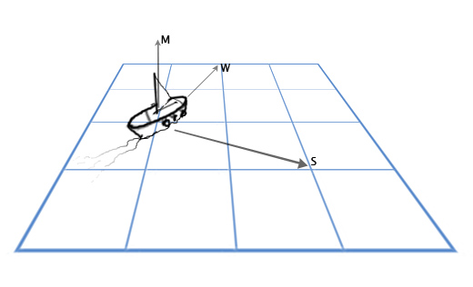

## Množenje vektora i skalara (skaliranje vektora)

Kada množimo skalar sa vektorom, zapravo skaliramo njegovu dužinu, dok smer ostaje nepromenjen.

Množenje vektora `v` skalarom `s` vršimo tako što sve pojedinačne komponente vektora množimo skalarom:

```js
s * v = (s * v.x, s * v.y, s * v.z)
```

U kodu:

```js
function skaliraj(v, s) {
  return {
    x: v.x * s,
    y: v.y * s,
    z: v.z * s
  }
}
```

Skaliranjem sa -1 vektor obrće smer, odnosno menja glavu i rep. Na primer:

\(\vec{v} = (3, -2, 5)\)

pomnožen sa -1 postaje:  

\(-\vec{v} = (-3, 2, -5)\)  

### Skaliranje vektora u igrama

U igrama često množimo vektor skalarom. Na primer, možemo simulirati otpor vazduha množeći brzinu igrača sa 0.9 pri svakom kadru.

## Skalarni proizvod (dot proizvod)

Skalarni proizvod vektora ili dot proizvod (*dot product*) je operacija koja za množenje dva vektora vraća realnu vrednost. Piše se pomoću tačke:  

\[
\vec{u} \cdot \vec{v}
\]  

Računa se na sledeći način:

```js
u.x * v.x + u.y * v.y + u.z * v.z
```

Skalarni proizvod dva jedinična vektora daje kosinus ugla između njih. Ako su vektori paralelni, \(\cos(0^\circ) = 1\), a ako su vektori ortogonalni, \(\cos(90^\circ) = 0\).



Kao što vidimo, kada vektori pokazuju u istom smeru, dot proizvod je pozitivan, kada su okomiti je  nula, a kada su suprotnog smera negativan. Dakle, dot proizvod je proporcionalan tome koliko se smer vektora poklapa.

### Dot proizvod u igrama

Recimo da imamo stražara na poziciji `G` (1,3) koji gleda u smeru `D` (1,1), sa vidnim poljem od 180 stepeni. Imamo heroja koji se šunja na poziciji `H` (3,2). Je li on u vidnom polju stražara? 

Da bismo to otkrili, prvo računamo vektor smera `V` od stražara do heroja:

```
V = H-G = (3,2)-(1,3) 
        = (3-1, 2-3) 
        = (2, -1)
```

Konačno, računamo skalarni proizvod vektora `D` (pogled stražara) i `V` (smer od stražara ka heroju), da saznamo njihovo poklapanje:

```
D•V = (1,1)•(2,-1) = 1*2+1*-1 = 2-1 = 1
```

Pošto je rezultat pozitivan, heroj je u vidnom polju stražara!

## Vektorski proizvod (unakrsni proizvod)

Vektorski proizvod ili unakrsni proizvod (eng. *cross product*) je operacija između dva vektora u 3D prostoru koja rezultira novim vektorom, normalnim na oba. Operacija se obeležava znakom `x`.

\(
\vec{u} \times \vec{v}
\)

Komponente rezultirajućeg vektora se računaju na sledeći način:

```js
[
  u.y * v.z - u.z * v.y, // x
  u.z * v.x - u.x * v.z, // y
  u.x * v.y - u-y * v-x  // z
]
```

### Redosled je bitan

Redosled činilaca je bitan jer vektorski proizvod nije komutativan:

\[
\mathbf{a} \times \mathbf{b} \neq \mathbf{b} \times \mathbf{a}
\]

Rezultirajući vektor ima uvek istu veličinu i normalan je na oba činioca, li mu smer zavisi od njihovog redosleda:

- Ako je redosled \( \mathbf{a} \times \mathbf{b} \), rezultat će biti u pravcu desne ruke.
- Ako je redosled \( \mathbf{b} \times \mathbf{a} \), rezultat će biti u suprotnom pravcu.

Smer rezultirajućeg vektora možemo vizuelizovati na sledeći način:


### Vektorski proizvod u igrama

Recimo da imamo brod sa topovima levo i desno. Ako je brod okrenut u smeru vektora (2,1), u kom smeru su okrenuti topovi? 

Ovo je prosto u 2D. Da bi rotirali vektor za 90 stepeni (u smeru kazaljke), prvo zamenimo mesta komponentama, a zatim predznak druge komponente. Tako (a,b) postaje (b,-a). Dakle, ako je brod okrenut u smeru (2,1), desni topovi su okrenuti u smeru (1,-2). Levi topovi su suprotni, dakle menjamo predznake oba broja dobivši: (-1,2).



Sada, recimo da imamo jedrenjak, sa jarbolom `M` okrenutim gore (0,1,0), i vetar `W` u smeru (1,0,2). Želimo jedro `S` da usmerimo da što bolje uhvati vetar, tj. ono mora biti ortogonalno i na jarbol i na vetar. 



Da bismo rešili ovo, koristimo vektorski proizvod:

```
S = M x W
  = (0, 1, 0) x (1, 0, 2) 
  = (1*2 - 0*0, 0*1 - 0*2, 0*0 - 1*1) 
  = (2, 0, -1)
```

Ovo naravno nećemo uvek raditi ručno. Za ubuduće, najbolje je vektorski proizvod enkapsulirati u funkciju:

```js
function cross(a, b) {
    return {
        x: a.y * b.z - a.z * b.y,
        y: a.z * b.x - a.x * b.z,
        z: a.x * b.y - a.y * b.x
    }
}
```

## 2D vektorski proizvod

2D vektorski proizvod, za razliku od 3D verzije, ne vraća vektor već skalar. Ovaj vrednost zapravo predstavlja dužinu normalnog vektora duž z-ose, ako bi unakrsni proizvod bio izveden u 3D. 

Na neki način, 2D vektorski proizvod je pojednostavljeni 3D vektorski proizvod. I ovde, redosled operacija je bitan: a×b nije isto što i b×a.

Dva vektora se mogu ukrstiti, skalar se može ukrstiti sa vektorom, i vektor se može ukrstiti sa skalarom. Evo operacija:

```js
// ukršteni proizvod dva vektora, vraća skalar
const crossProduct = (a, b) => a.x * b.y - a.y * b.x

// ukršteni proizvod vektora i skalara, vraća vektor
const vectorCrossWithScalar = (a, s) => ({
    x: s * a.y,
    y: -s * a.x
})

// ukršteni proizvod skalara i vektora, vraća vektor
const scalarCrossWithVector = (s, a) => ({
    x: -s * a.y,
    y: s * a.x
})
```

Kod poslednje dve funkcije razlika je samo u redosledu argumenata, što utiče na smer rezultujućeg vektora, ali ne i na njegovu veličinu.
