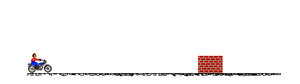
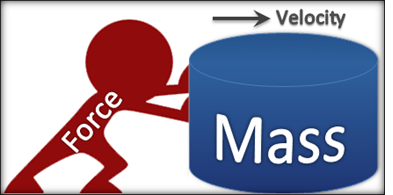
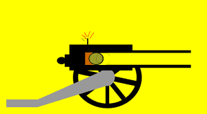

# Njutnovi zakoni kretanja

Isak Njutn je u 17. veku otkrio tri zakona koja regulišu svo kretanje na Zemlji (osim na molekularnom nivou). Najvažniji je Njutnov drugi zakon, koji upravlja gotovo svim interakcijama predmeta u igrama.

## Prvi Njutnov zakon (Zakon inercije)

> Svako telo ostaje u stanju relativnog mirovanja ili ravnomernog pravolinijskog kretanja sve dok ga dejstvo drugog tela ne prisili da to stanje promeni.



Prirodna je tendencija tela da zadrži svoje stanje. Ako se kreće, kretaće se, ako miruje, mirovaće. Ovaj scenario važi samo kada je razultat svih sila 0, tj. kada je telo neometano. U praksi, ravnomerno kretanje nikada ne potraje, jer se priroda raznim silama opire kretanju: gravitacijom, trenjem (po tlu) i vučenjem (kroz vodu i vazduh).

Zakon inercije vidimo na delu prilikom sudara, kada telo vozača teži da ostane u stanju kretanja.

## Drugi Njutnov zakon (Zakon sile)

>	Ubrzanje je srazmerno primenjenoj sili, a obrnuto srazmerno masi tela.



Dakle, ubrzanje izaziva sila, a protivi mu se masa:

```
a = F / m
```
odnosno:
```
F = m * a
```

U višedimenzionalnim svetovima (2D i 3D) `F` i `a` su vektori. To znači da možeš računati svaku dimenziju posebno:
```
Fx = m * ax
Fy = m * ay
```
U 3D kretanju postoji i z osa:
```
Fz = m * az
```

## Treći Njutnov zakon (Zakon akcije i reakcije)

>	Sila kojom jedno telo deluje na drugo telo jednaka je po intenzitetu sili kojom drugo telo deluje na prvo, ali je suprotnog smera.

Na primer, kada top ispaljuje projektil, projektil ga pomera nazad.



## Primena

Prvi i drugi zakon se implementiraju u fazi integracije, a treći prilikom razrešenja sudara.
