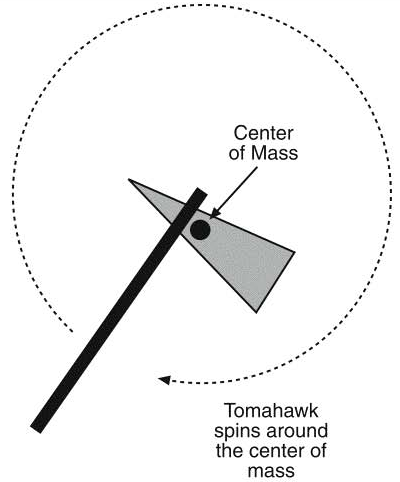

# Rotaciono kretanje

A fundamental difference between particles and rigid bodies is that we cannot ignore rotation of rigid bodies.

Pošto različite tačke čvrstog tela pređu različite putanje, različite su im brzine. Zbog toga je za opisivanje rotacionog kretanja potrebno uvesti nove veličine.

Newton’s 2nd Law of Motion can be extended to rotation in a relatively straightforward manner. We’ll only need to update the variables slightly to solve for rotation.

First of all, our variables change:
* pomeraj -> ugaoni pomeraj
* pređeni put *position* -> opisani ugao *rotation angle* (θ theta, u radijanima)
* brzina -> ugaona brzina (ω omega, radijani po sekundi)
* ubrzanje -> ugaono ubrzanje (α alpha, radijani po sekundi na kvadrat)
* masa -> ugaona masa ili momenat inercije (different shapes have different moments of inertia, even if they’re the same mass)
* sila -> moment sile ili obrtni momenat

## Obrtni moment (*torque*)

Moment sile ili obrtni moment je tendencija sile da rotira predmet. Think of a wrench. As you push on it to get a bolt loose, you apply a certain force to the end of a wrench of some length.

Torque can be calculated by figuring out how far a force is applied from the center of rotation of an object. For example, if you’re using a wrench that’s one foot long and you push on it at an exact 90 degree angle with 5 pounds of force, the torque on the bolt is 5 foot-pounds. If you push at a different angle, the torque will be less. If you pushed directly in towards the bolt from the end of the wrench, the torque would be zero and the wrench won’t move!

Torque is measured by force, specified in Newton-meters. 5 Newton-meters is a 5 Newton force applied about a 1 meter length.

## Drugi Njutnov zakon (prilagođen)

So we can rewrite Newton’s 2nd Law for rotation:
```
T = J * a
moment sile = ugaona masa * ugaono ubrzanje
```

It is important to understand that linear velocity is the velocity of the center of mass of a rigid body. If object has no rotational components, the velocity of the center of mass is the same for all points on a body. When orientation is introduced, points farther away from the center rotate faster than those near the center.

## Center of mass

When the object rotates freely, it always rotates about the center of mass. Different objects rotate very differently, depending on their shape and how their weight is distributed.



https://gamedevelopment.tutsplus.com/tutorials/how-to-create-a-custom-2d-physics-engine-oriented-rigid-bodies--gamedev-8032
