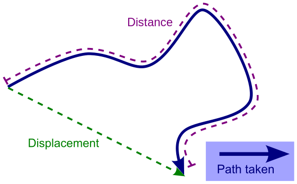

# Kretanje

Na računaru, možeš podesiti položaj predmeta kako god želiš. U stvarnom svetu je drugačije. Telo ima svoj položaj, pomera se pomoću kretanja, a kretanje se postiže dodavanjem sile. Kada računamo kretanje, interesuju nas položaj, brzina i ubrzanje tela. Položaj (x, y) se uvek odnosi na centar mase.

Svako telo se sastoji od mnoštva tačaka. Prema načinu kretanja tačaka u telu, kretanje delimo na:
* obično ili translatorno kretanje (sve tačke tela se kreću na isti način i opisuju iste putanje)
* rotaciono kretanje (različite tačke tela prelaze različite kružne putanje)


Nauka o kretanju se zove kintetika.

## Pređeni put (*distance*) i pomeraj (*displacement*)

U jednoj dimenziji (npr. kretanje po liniji), pređeni put je uvek jednak pomeraju. Čim imamo kretanje u dve ili više dimenzija, pređeni put je po pravilu duži od putanje vazdušnom linijom, koja se zove pomeraj.

When calculating displacement, all you care about is where the object starts and where it ends.

Football is a good example of displacement versus distance. Suppose player catches the ball on the 20-yard line and starts running. There's a blocker in the way, so the receiver circles around the blocker, avoids the other defender running toward him, and eventually gets tackled on the 50-yard line. The positive 30 yards is his displacement even though the actual distance traveled is much more.



## Brzina (*speed*) i vektorska brzina (*velocity*)

Usmerena brzina (*velocity*) je vektorska verzija brzine. Na primer, 50km/h je obična brzina (skalar). Međutim, 50km/h istočno je usmerena brzina (vektor).

Obična brzina se računa iz pređenog puta u odnosu na vreme:
```
prosečna brzina = pređeni put / vreme
```

Vektorska brzina se izvodi iz pomeraja u odnosu na vreme:
```
v = Δs / Δt
usmerena brzina = pomeraj / vreme
```

Vektorska brzina je zapravo promena položaja kroz vreme:

```java
Vec3 CalcVelocity(Vec3 pos0, Vec3 pos1, float time)
{
  return (pos1 - pos0) / time;
}
```

If you care only how fast an object is moving, use the speed. If you're trying to guide the motion of an object, always use velocity.

## Ubrzanje (*acceleration*)

Any time an object's velocity changes, it experiences an acceleration; it speeds up or slows down. The faster an object speeds up, the higher the acceleration. If the velocity doesn't change at all, the acceleration must be 0.

Average acceleration is change in velocity over change in time:
`a = Δv/Δt`

Acceleration is the change in velocity over time:
```cpp
Vec3 CalcAcceleration(Vec3 vel0, Vec3 vel1, float time)
{
  return (vel1 - vel0) / time;
}
```

This function will calculate the acceleration in seconds:
```java
float calcAccelerationSeconds(float startVel, float finalVel, float time)
{
  return (finalVel - startVel) / time;
}
```

Any time you step on the gas pedal, the car speeds up or accelerates. As soon as you release the gas pedal, the car starts to slow down or decelerate. The only way to avoid accelerating is to turn on the cruise control.

Ako čovek padne sa bicikla... If the same biker crashes while riding downhill, the slightly faster speed does quite a bit more damage because acceleration has a time squared component and is therefore much more serious than a change in mass.

## Računanje brzine, položaja i ubrzanja

Acceleration, velocity, and position are closely related. Velocity is the “rate of change over time” of position. Think of the way we measure velocity: in km per hour, or meters per second. Velocity is a measure of distance travelled in time. Similarly, acceleration is a measure of velocity changed in time.

The relationship between position, velocity, and acceleration is very helpful, because if we know the history of an object’s position, we can figure out its velocity by asking “how much did this object move in the last second?” We can calculate acceleration similarly. More importantly, we can work backwards. If we know an object’s acceleration, we can figure out how much the velocity is supposed to change every second. And if we know the velocity, we can figure out how much the position is supposed to change every second. This technique is called “integration”.

The simplest way to perform numerical integration is called Euler’s method. Here’s some pseudocode handles force, acceleration, velocity, and position (assume all start at 0):
```
acceleration = force / mass
velocity += acceleration * time_step
position += velocity * time_step
```

Euler’s method is great to build a conceptual understanding from, but it’s not quite accurate. We’ll go a step further and use Velocity Verlet integration. Instead of the above, we can do the following:

```
last_acceleration = acceleration
position += velocity * time_step + (0.5 * last_acceleration * time_step^2)
new_acceleration = force / mass
avg_acceleration = (last_acceleration + new_acceleration) / 2
velocity += avg_acceleration * time_step
```

The most significant difference between the two methods is the use of the average acceleration between the last frame and the current one. This change gives us a significant accuracy advantage.

## Jednačine kretanja (*equations of motion*)

Equations of motion hold only when the acceleration is constant. If you have a scenario in which the acceleration changes, just break it into smaller time intervals of constant acceleration. This works perfectly in programming, because you address motion on a frame-by-frame basis.

These five equations can help you solve any problem related to one-dimensional motion with constant acceleration:

* final velocity = initial velocity + acceleration * time
* average velocity = (initial velocity + final velocity) / 2
* displacement = 1/2 (initial velocity + final velocity) * time
* displacement = initial velocity * time + 1/2 acceleration * time^2
* final velocity^2 = initial velocity^2 + 2 * acceleration * displacement.

In a 3D world, we’re going to use the same formulas, but the inputs are going to be 3D vectors to represent position, speed, and acceleration. Luckily, these vectors work exactly the same as scalars in these equations.
