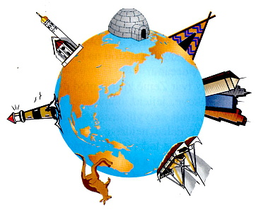
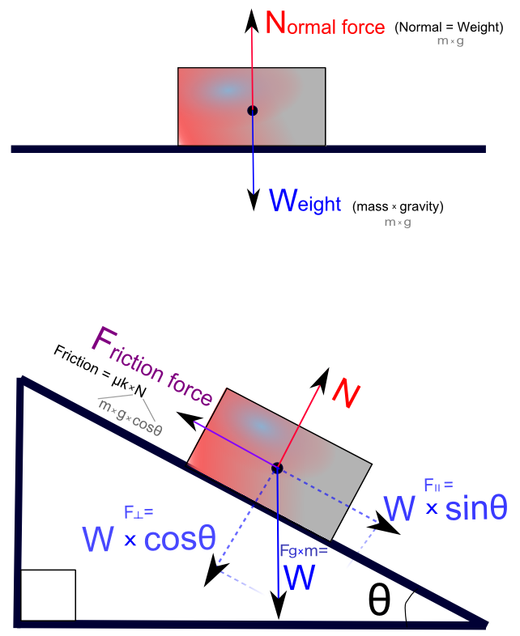

# Teža ili težina (*weight*)




Weight is the force with which gravity pulls on a mass. Gravity is a constant force always pulling down. Whenever we looked at the vertical components of the motion, we used `–g` for the acceleration. You can use that gravitational constant to calculate the weight. Weight is a vector force, and its direction is always down toward the center of the earth. The magnitude of weight is the object's mass times the acceleration due to gravity:
```
w = m * g
```

Even though we tend to use mass and weight interchangeably, in physics they are two very different quantities. Mass is a scalar, weight is a vector. Mass is measured in kilograms, weight is measured in newtons. Weight can change if the gravity changes. The mass always stays the same no matter where the object is.

At sea level, Earth’s gravity causes an acceleration of exactly `9.80665 meters/s^2` on every object. Thus, a one kilogram object exerts a force of 9.80665N.

Galileo discovered an interesting property about the acceleration due to gravity, by dropping things from the Leaning Tower of Pisa: It doesn’t matter how much something weighs because they all fall at the same rate, excepting any large differences in air resistance. More massive objects exert a greater gravitational force, but this force is used to accelerate the larger mass, therefore the acceleration remains the same.

# Normalna sila (*normal force*)

Have you ever wondered why, if gravity is always pulling you down, you don't perpetually fall? The ground actually exerts a force on you as well. The normal force is the force of the surface the object is on, that counteracts gravity. It's called the normal force because this force is always perpendicular (normal) to the surface.

Weight is always a negative value, because the direction is down toward the center of the Earth. That is why the normal force must always have a positive value.


