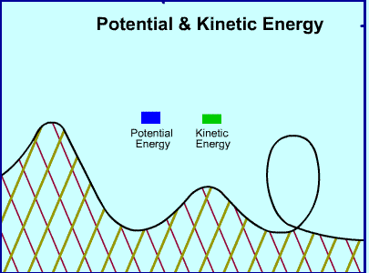

# Energija

Energy is an alternative approach to modeling motion (pored sile).

## Rad (*work*)

In physics, work has a very precise definition. Rad je prenos energije iz jednog sistema u drugi, koji se vrši delovanjem sile. Rad se vrši kada sila primenjena na predmet pomera taj predmet. Rad je jednak proizvodu sile i pomeraja (*displacement*), ako sila deluje u pravcu pomeranja tela. Object must move for work to be done.

```
W = F * s
```

The force is measured in Newtons, and the displacement is measured in meters, which means that the work is measured in Newton-meters (N*m). This unit has been renamed the joule (J), so `1 J = 1 N * m`.

Programming the calculation for work is fairly straightforward. Here is a function that returns the amount of work done, given a force, a friction force, and a displacement:

```java
float calculateWork(float force, float friction, float displacement)
{
  float netForce = force - friction;
  float temp = displacement * netForce;
  return temp;
}
```

Here is a function that will return the amount of work done considering an angled force:

```java
float calculateAngledWork(vector2D vect, float friction,float displacement)
{
  float temp;
  //don't forget to convert to rads....
  temp = cos(DegreesToRads(vect.y));
  float horizForce = vect.x * temp;
  float work = calculateWork(horizForce, friction, displacement);
  return work;
}
```

## Kinetička energija (energija kretanja)

Kinetička energija je količina energije koju predmet ima usled kretanja. The faster it's moving, the more kinetic energy it has. It's similar to momentum, which is mass times velocity. It is equal to the energy required to accelerate the body from rest, which is also equal to the energy required to bring the moving body to a stop.

The kinetic energy is one-half of the mass times the speed squared (scalar quantity):
```
KE = 1/2m * v^2
```

This function will calculate kinetic energy given a mass in kilograms and a speed in meters per second:

```java
float calculateKineticEnergy(float mass, float speed)
{
  float KE;
  KE = (mass/2) * (pow(speed,2));
  return KE;
}
```

Work-Energy Theorem states that the total work done on an object is equal to the change in its kinetic energy.
```
W = DKE = KE f – KE i
```

## Potencijalna (nagomilana) energija

Potencijalna energija je energija koju telo ima u vezi sa položajem ili oblikom, spremna da se pretvori u kinetičku energiju. Na primer, elastična potencijalna energija je povezana sa elastičnim silama koja deluju na elastičnost deformisanog tela. Energija navijene opruge pokreće dečje igračke. Kada se naduva balon pusti on leti, usled nagomilane energije u sabijenom vazduhu.

Gravitaciona potencijalna energija (GPE) nastaje usled gravitacione sile koja dejstvuje na masu tela. To je energija smeštena u predmetu usled njegove visine od tla. If you picked up a stone and held it in the air, it would have gravitational potential energy. The potential energy was stored in the stone until it was released. Isto tako, peščanik koristi potencijalnu energiju peska koji polako pada iz gornje pregrade u donju.

```
GPE = m * g * y
GPE = masa * gravitacija * visina
```

## Zakon očuvanja energije



Roler koster na dnu svoje putanje dostiže maksimum energije kretanja. Kada krene naviše, energija kretanja se pretvara u gravitacionu nagomilanu energiju. Zbir kinetičke i nagomilane energije ostaje stalan, ignorišući gubitak usled trenja.

The entire ride was governed by the law of conservation of energy. This law says that energy cannot be created or destroyed. It can only switch forms.

```
KE i + PE i = KE f + PE f
```

The faster an object moves, the more kinetic energy it has, and the higher it is off the ground, the more potential energy it has. What's fascinating is that the total amount of energy always remains the same.

As time goes on, energy is lost. In real life, some energy is lost to heat and sound because of friction and air resistance, but calculating the precise amount can be quite expensive in terms of processing power.

Na primer, kinetička energija ljuljaške se polako pretvara u toplotnu, usled trenja. Zato se ljuljaška usporava i zaustavlja.

Savet: add an extra value that represents heat and sound energy, which produces a more realistic result.
