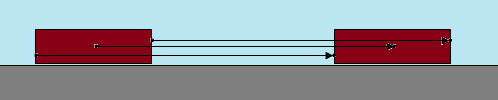
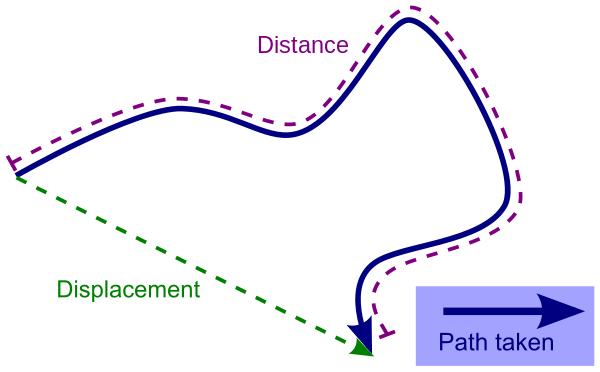

# Kretanje

Na računaru, možeš podesiti položaj predmeta kako god želiš. U stvarnom svetu je drugačije. Telo ima svoj položaj, pomera se pomoću kretanja, a kretanje se postiže dodavanjem sile. Kada računamo kretanje, interesuju nas položaj, brzina i ubrzanje tela. Položaj (x, y) se uvek odnosi na centar mase.

Svako telo se sastoji od mnoštva tačaka. Prema načinu kretanja tačaka u telu, kretanje delimo na:
* obično ili translatorno kretanje (sve tačke tela se kreću na isti način i opisuju iste putanje)
* rotaciono kretanje (različite tačke tela prelaze različite kružne putanje)



Nauka o kretanju se zove kintetika.

## Pređeni put (*distance*) i pomeraj (*displacement*)

U jednoj dimenziji (npr. kretanje po liniji), pređeni put je uvek jednak pomeraju. Čim imamo kretanje u dve ili više dimenzija, pređeni put je po pravilu duži od putanje vazdušnom linijom, koja se zove pomeraj (en. *displacement*).

When calculating displacement, all you care about is where the object starts and where it ends.

Football is a good example of displacement versus distance. Suppose player catches the ball on the 20-yard line and starts running. There's a blocker in the way, so the receiver circles around the blocker, avoids the other defender running toward him, and eventually gets tackled on the 50-yard line. The positive 30 yards is his displacement even though the actual distance traveled is much more.



## Brzina (*speed*) i vektorska brzina (*velocity*)

Usmerena brzina (en. *velocity*, skraćeno `v`) je vektorska verzija brzine. Na primer, 50km/h je obična brzina (skalar). Međutim, 50km/h istočno je usmerena brzina (vektor).

Obična brzina se računa iz pređenog puta u odnosu na vreme:
```
prosečna brzina = pređeni put / vreme
```

Vektorska brzina se izvodi iz pomeraja u odnosu na vreme:
```
v = Δs / Δt
usmerena brzina = pomeraj / vreme
```

Vektorska brzina je zapravo promena položaja kroz vreme:

```java
Vec3 CalcVelocity(Vec3 pos0, Vec3 pos1, float time)
{
  return (pos1 - pos0) / time;
}
```

If you care only how fast an object is moving, use the speed. If you're trying to guide the motion of an object, always use velocity. Mi ćemo pod brzinom nadalje podrazumevati vektorsku brzinu.

## Ubrzanje (*acceleration*)

Ubrzanje (en. *acceleration*, skraćeno `a`) je promena brzine u jedinici vremena. Negativno ubrzanje se naziva usporenje ili kočenje. Ako se brzina ne menja, ubrzanje je 0.

Prosečno ubrzanje je promena brzine u vremenu:
```
a = Δv / Δt
```

U kodu:
```cpp
Vec3 CalcAcceleration(Vec3 vel0, Vec3 vel1, float time)
{
  return (vel1 - vel0) / time;
}
```

Any time you step on the gas pedal, the car speeds up or accelerates. As soon as you release the gas pedal, the car starts to slow down or decelerate. The only way to avoid accelerating is to turn on the cruise control.

Ako čovek padne sa bicikla na nizbrdici, neznatno veća brzina čini znatno veću štetu, because acceleration has a time squared component and is therefore much more serious than a change in mass.

## Momentum

Momentum is defined as mass times velocity.
```
p = m * v
```

Because momentum is based on velocity, which constantly changes, it makes sense to talk about instantaneous momentum at specific points in time or change in momentum over a time interval.

Savet: Add a small force vector every frame in the direction the vehicle is currently facing, to simulate momentum. It’s important that this force vector be a percentage of the speed rather than a literal value.

## Inercija

When we wish to change the speed, the body shows a certain resistance against such changes. This resistance, called inertia, is a result of the body's mass. The larger the mass of the body, the smaller the change of speed will be.

## Jednačine kretanja (*equations of motion*)

Ovih pet jednačina će nam rešiti svaki problem vezan za kretanje sa konstantnim ubrzanjem:

* krajnja brzina = pocetna brzina + ubrzanje * vreme
* prosecna brzina = (pocetna brzina + krajnja brzina) / 2
* pomeraj = 1/2 (pocetna brzina + krajnja brzina) * vreme
* pomeraj = pocetna brzina * vreme + 1/2 ubrzanje * vreme^2
* krajnja brzina^2 = pocetna brzina^2 + 2 * ubrzanje * pomeraj

In a 3D world, we’re going to use the same formulas, but the inputs are going to be 3D vectors. Luckily, these vectors work exactly the same as scalars in these equations.

Jednačine kretanja važe samo kad je ubrzanje konstantno. Ako se ubrzanje u igri menja, podeli ga u manje vremenske intervale konstantnog ubrzanja. Ovo radi savršeno, jer se računanje vrši svakog kadra.
