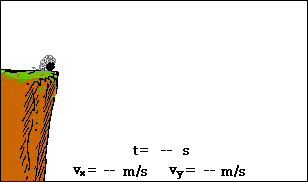
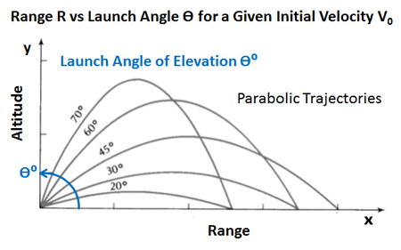
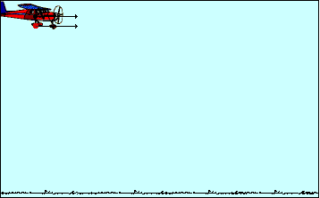
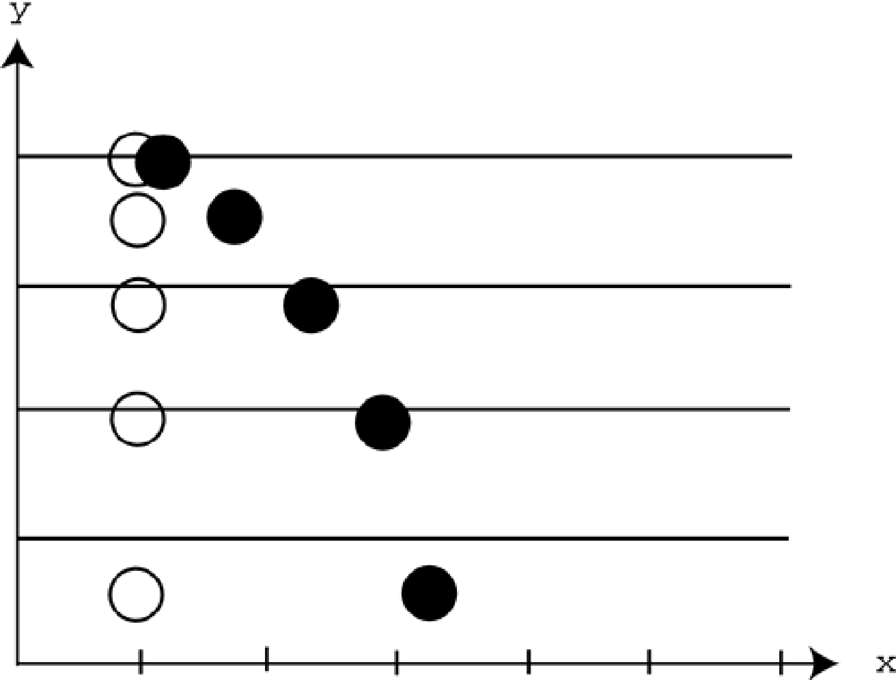
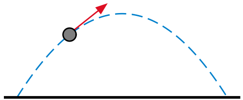
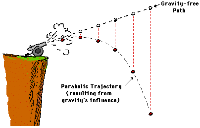

# Projektil



Any object that has been thrown, kicked, or shot and that is flying through the air is considered a projectile. Nauka o kretanju projektila se zove balistika (grana mehanike).

A projectile is an object that is placed in motion by a force acting over a very short period of time (an impulse). After the projectile is set in motion by the initial impulse during the launching phase, the projectile enters into the projectile motion phase, where there is no longer a thrust or propulsive force acting on it.

The trajectory is parabolic. Ako isključimo sve druge sile, onda maximum range, for a given launch velocity, occurs when the launch angle is 45°.



## Nezavisnost dimenzija



The easiest way to approach a 2D projectile is to break all the vector quantities into components, and then separate the horizontal components from the vertical ones. The components are completely independent of each other.

Try this simple experiment. Put two identical balls on a table. Roll one ball off the edge of the table, and watch it fall to the floor in a parabolic path. Now, drop the other ball from the same height at the exact same time that the first ball reaches the edge of the table. They should hit the floor at the same time.



Štaviše, if you fire a bullet horizontally and drop a bullet at the same time, they will hit the ground at the same time.

When a projectile is shot horizontally, the initial vertical velocity is zero.

## Parabola

Any projectile follows what is called a parabolic path. A parabola is really just a fancy name for a symmetric arc.



You will use two components of the parabola to determine its equation. The first is the vertex, which is the very tip of the arc. The second is the axis of symmetry, which goes through the vertex and splits the parabola down the middle so that each side is a reflection of the other.

A parabola with a vertical axis of symmetry:
```
y = a * (x – h)^2 + k
```
with vertex (h, k) and axis of symmetry x = h.




https://www.khanacademy.org/science/physics/two-dimensional-motion/two-dimensional-projectile-mot/v/visualizing-vectors-in-2-dimensions
