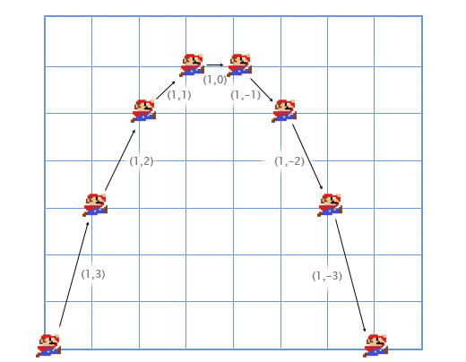
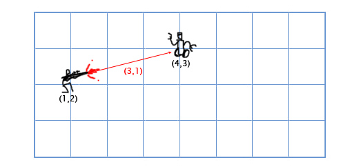

# Sabiranje i oduzimanje vektora

Vektori su mogu sabirati prema pravilima linearne algebre.

## Sabiranje vektora

To add vectors together, you just add each component together separately. For example:

[0, 1] + [3, -2] = [(0 + 3), (1 - 2)] = [3, -1]

In games, common applications for vector addition is physics integration. Any physically-based object will likely have vectors for position, velocity, and acceleration. For every frame, we have to integrate these vectors - that is, add the velocity to the position, and the acceleration to the velocity.

Let's consider the example of Mario jumping. As he starts the jump, his velocity is (1,3) - he is moving upwards quickly, but also to the right. His acceleration throughout is (0,-1), because gravity is pulling him down. Here is what his jump looks like over the course of 8 frames:



Kao što vidiš, svakog kadra se dodaje gravitacija (-1) na njegovu vertikalnu brzinu. Obično u igrama igrač dodaje ubrzanje, a igra računa brzinu i položaj sabiranjem vektora.

You can think of vector addition as displacement on a map. If you travel along vector `v` and then turn and follow vector `w`, you really go from the beginning of `v` to the end of `w`.


Sabiranjem vektora izračunavamo ukupnu silu (rezultantu) koja deluje na neki predmet:


Sabiranje 3D vektora:
```
a + b = [ (a x + b x ), (a y + b y ), (a z + b z ) ]
```

## Oduzimanje vektora

We can also subtract one vector from another:
* first we reverse the direction of the vector we want to subtract,
* then add them as usual:


Vector subtraction `a – b` is nothing more than addition of `a` and `–b`:
```
a – b = [ (a x – b x ), (a y – b y ), (a z – b z ) ]
```

Vector subtraction is useful for getting a vector from one position to another. For example, let's say the player is standing at (1,2) with a laser rifle, and an enemy robot is at (4,3). To get the vector that the laser must travel to hit the robot, you can subtract the player's position from the robot's position:
```
(4,3) - (1,2) = (4-1, 3-2) = (3,1).
```


