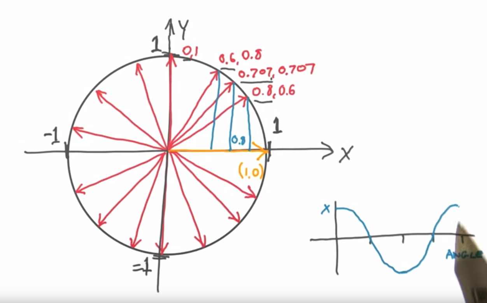

# Vektori

Vektor je veličina koja ima intenzitet i smer. Vektore i matrice proučava linearna algebra.

Vektor možemo vizuelizovati kao duž koja ima glavu i rep.


Intenzitet je dužina vektora. We can use the Pythagorean theorem to calculate a vector’s magnitude.


Vectors entered math in the 19 century, as mathematicians and physicists wrestled to describe motion, rather than static position.

## Vektori u igrama

In games, vectors are used to store positions, directions, and velocities. Here are some 2-Dimensional examples:


The position vector indicates that the man is standing two meters east of the origin, and one meter north. The velocity vector shows that in one minute, the plane moves three kilometers up, and two to the left. The direction vector tells us that the pistol is pointing to the right. As you can see, a vector by itself is just a set of numbers -- it is only given meaning by its context. For this reason, it's important to keep track of your units. Let's say we have a vector V (3,5,2). This doesn't mean much by itself. Three what? Five what? In some games, positions are always given in meters, and velocities in meters per second.

There are no built-in data types for storing vectors. Vectors can be coded as an array of numbers or as a user-defined structure.

```c
struct 3Dvector
{
  float x, y, z;
};
```

It is possible to create an extremely powerful structure or class which can encompass almost every operation which could be needed.

In short: get comfortable with vectors. The first thing you should do is write a simple vector class that does vector addition, subtraction, multiplication, dot product, cross product, and rotation. That’s all you need. The rest of your physics engine will be built atop vectors.

## Skalari

When we talk about vectors, we refer to individual numbers as scalars. Scalars are any quantity that can be measured using a number (temperature, length, mass...). It have magnitude but no direction.

Zove se skalar jer skalira vektor.

## Vector vs. Scalar

The difference between vectors and scalars lies in the direction.

For example, suppose your friend is having car trouble, and he calls and asks you to come pick him up because he's only 2 miles away. You say no problem and hop in your car. But how will you find him? If he had said 2 miles due east on your street, you might have had a better chance of locating him. That's the difference between vectors and scalars.

## Coordinate system

In one dimension there are only two possible directions, positive or negative. In 2D, positive or negative isn't enough.

There are two ways for describing a vector in 2D: polar coordinates and Cartesian coordinates. Polar coordinates describe its length and direction, Cartesian coordinates describe its horizontal and vertical displacement.

## Normalizacija vektora (jedinični vektor)

A unit vector is a vector with a length of 1. We can convert any vector to a unit vector that points in the same direction, but has unit length.

To normalize a vector, divide each component by the vector's length. If we want to normalize vector (3,4), we divide each component by its length, 5, to get (3/5, 4/5).

X-axis of unit vector is typically called `i`, y-axis is `j`, and z-axis is `k`.

In games, when we are dealing with directions (as opposed to positions or velocities), it is important that they have unit length. For example, let's say there is a gun pointing in the direction of (1,0) that shoots a bullet at 20 m/s. What is the velocity of the bullet? Since the direction has length 1, we can just multiply the direction and the bullet speed to get the bullet velocity: (20,0).

## Normal Vectors

A vector is said to be normal to a surface if it is perpendicular to it. Be careful not to confuse the term “normalization” with the term “normal vector.”

## Vector unit circle

Dot proizvod dva normalizovana 2D vektora od kojih je jedan jedinični vektor (1, 0) je uvek x komponenta drugog. Na primer:
```
(0.8, 0.6) * (1, 0) = 0.8 * 1 + 0.6 * 0 = 0.8 + 0 = 0.8
```

Na kraju dobijamo neku vrstu jediničnog kruga, gde je dot proizvod zapravo kosinus.



## Direction Inversion

Geometrically, direction Inversion of the vector is very simple. Just switch the tail and the head.

If you think of vectors in terms of Cartesian coordinates, inverting is a simple matter of swapping the two coordinates.

## Trigonometrijske funkcije

The sine can be used to calculate the y-coordinate of a vector, and the cosine can be used to calculate the x-coordinate. The sin() and cos() functions take the angle, and return a number between -1 and 1. If you multiply this number by the length of the vector, you will get the exact Cartesian coordinates of the vector:
```
speed_x = speed * cos(angle);
speed_y = speed * sin(angle);
```

http://alfonse.bitbucket.org/oldtut/Basics/Introduction.html
