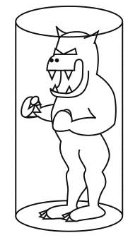

# Otkrivanje sudara (*collision detection*)

Otkrivanje sudara (ili detekcija kolizije) podrazumeva niz metoda kojima otkrivamo da li se dva geometrijska tela dodiruju.

Otkrivanje sudara je najkomplikovaniji deo svakog fizičkog pogona igre. Physics engines usually works collision detection by creating a physical body, attached to a visual representation of it. This body has properties such as velocity, position, rotation, torque, etc., and also a physical shape.

Collision detection is very expensive operation, and since a game may have dozens or hundreds of objects, a lot of effort is put into optimizing collision detection algorithms. Additional layer of complexity arises when objects that can rotate collide. And yet another degree of complexity emerges when you try to collide objects with complex shapes.

And, unfortunately, there’s yet another level of complexity hidden here: if you have very fast moving objects (like bullets), it’s possible that they’ll “hop” over their target from one frame to the next and avoid collision detection altogether, even though the bullet has passed through the target. The fix for this is called continuous collision detection.



Rolling your own is typically the best way to make sure your game is never finished! However, knowing what an engine does internally to make your life easier is extremely beneficial to you as a developer.

## Široka faza

Široka faza detekcije sudara je deo procesa detekcije sudara u simulaciji fizike. Ova faza je namenjena da filtrira objekte koji nisu u potencijalnom sudaru, tako da se ne obrađuju u detaljnoj fazi detekcije sudara. To se obično postiže korišćenjem algoritama za brzo pretraživanje, kao što su Bounding Volume Hierarchy (BVH) ili Spatial Hashing. 

## Primena

Collision detection is usually performed in two phases:
* broad phase and
* narrrow phase.

Broad phase detection is computationally low cost operation that quickly answers the question, “Which objects have a strong possibility of colliding?” Narrow phase “What part of object A colided with object B?” is typically computationally intense.

A collision detection routine may look something like this:

* Split the world up into sections via a grid or a quadtree (or octree in 3D)
* If two objects are in the same section of the grid, use a very simple collision routine to see if you should investigate further. Typically you’ll use AABB testing for this.
* If you still think the objects are colliding, use a more thorough algorithm to get the final word on if they’re colliding.
* If they are colliding, extract information about the collision and figure out how to make the objects react.

Because the collision geometry and visible geometry are usually different, make collision a little smaller than the visible. The objects won’t get stuck so much, or appear to hit something that isn’t there.

-----
A broad phase should collect a bunch of possible collisions and store them all in Pair structures. These pairs can then be passed on to another portion of the engine (the narrow phase), and then resolved.

## Pristup gole sile (*brute force*)

In any collision detection scheme, every object must be tested at least once. The most simple form is called a brute force test, where every object is uniquely tested (no duplication of tests) for collision with every other object. For games with very few objects, this is more than likely the fastest and simplest method. However, the computational complexity of this method increases quadratically for every object you add. This quickly becomes the biggest bottleneck of the game.

## Layering

Layering refers to the act of having different objects never collide with one another. This is key for having bullets fired from certain objects not affect certain other objects. For example, players on one team might want their rockets to harm the enemies but not each other.

Ako predmeti nisu na istom sloju, ne proverava sudar:
```js
if (a.layer != b.layer) continue;
```

https://github.com/jeffThompson/CollisionDetectionFunctionsForProcessing
