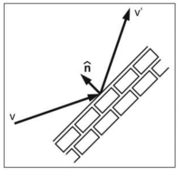
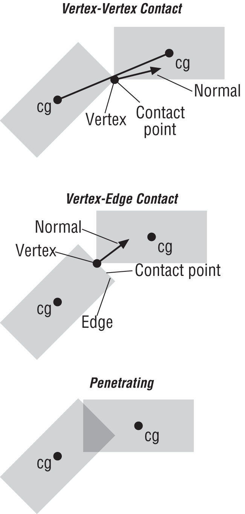
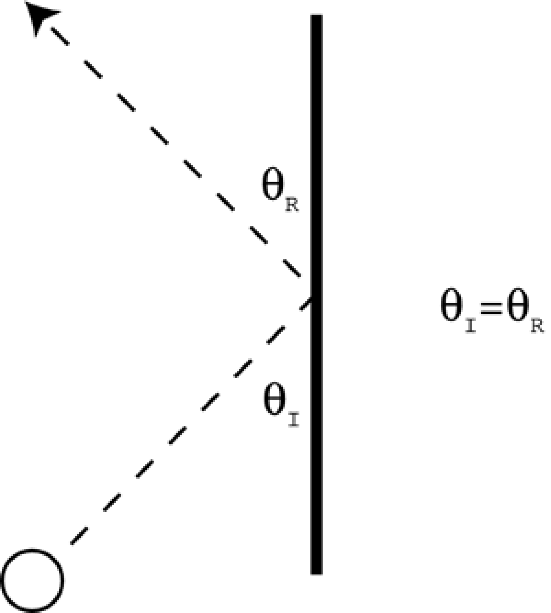
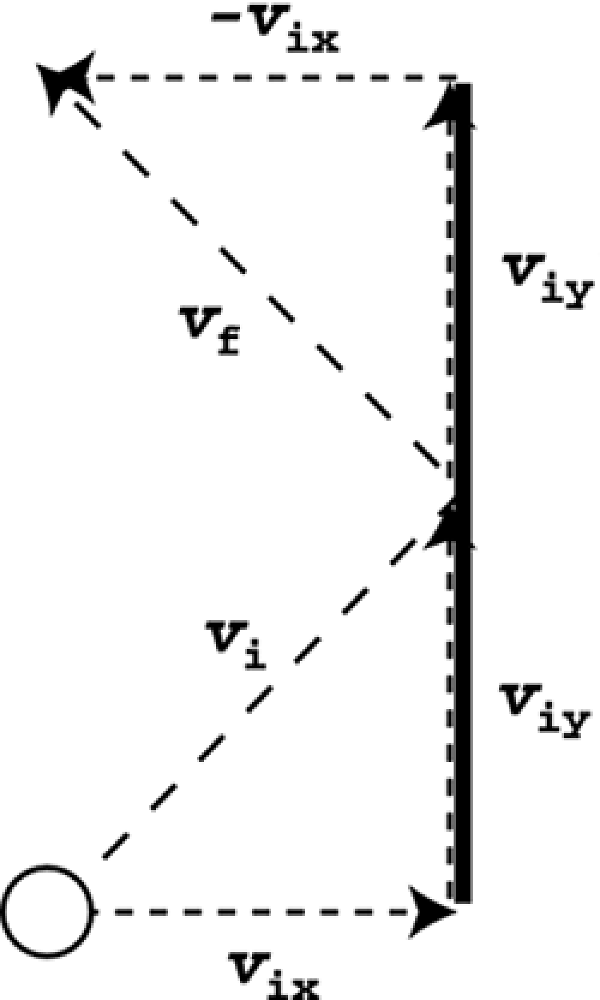

## Razrešenja sudara (*collision resolution*) ili sudarni odgovor (*collision response*)

Collision response coming after a collision is detected. Collision response is a kinetics problem involving the motion of two or more objects after they have collided.

Much of collision response will depend on your game mechanics. A missile fired at a character should do damage and explode. But pure physical response is: two boxes knocking into each other and bouncing away.

Collision response for two simple shapes without rotation is pretty easy. Rotating objects are a bit more complex. Not only they will bounce, but their rotation will change based on which points on the objects are involved with the collision.

Additionally, since objects in real life very rarely “overlap” the way they can in a computer simulation, we’ll typically backtrack and correct their positions so that they’re just touching and not overlapping at all.

## Restitution

Real objects aren’t perfectly hard, so we introduce the coefficient of restitution, which basically models the elasticity of the collision.



Restitution is the amount of bounce that an object has when it hits something. A good way to think of this is how high a ball will bounce when you drop it. If the restitution is 0.0f, when it hits it will simply stick to the ground. If you’ve got something like 0.99f, you’ve got a nice superball that will bounce around for a long time.

## Ugaoni efekat (*angular effects*)

Including angular effects will yield more realistic collision responses for these rigid bodies.



## Odbijanje vektora (*vector reflection*)

The simplest type of collision to model is one in which a moving object collides with a stationary object (lopta udari u zid). This type of scenario can be modeled using vector reflection. An interesting symmetry exists: The angle that the ball comes in at must equal the angle at which it leaves.



Ako je zid uspravan, all you have to do is reverse the horizontal component of the velocity when the ball hits. Similarly, if the wall is horizontal, all you have to do is reverse the direction of the vertical component of the ball's velocity.

(samo se obrne dx ili dy)



If the stationary boundary is vertical: `vf = [–vix viy]`

if the stationary boundary is horizontal: `vf = [vix –viy]`

for incoming velocity vi = [vix viy].

Možemo koristiti sledeću funkciju:

```java
vector2D axisAlignedCollision(vector2D vect, char b)
{
  vector2D temp = vect;
  if (b == 'v')
    return temp.x *= -1;
  else if (b =='h')
    return temp.y *= -1;
}
```

Ako zid nije uspravan ni horizontalan, the first thing you need to find is the normal (N) to the line of the stationary object. The slopes are negative reciprocals of each other. So if the slope of the boundary line (B) is Dy/Dx, the slope of the normal (N) must be –Dx/Dy.
