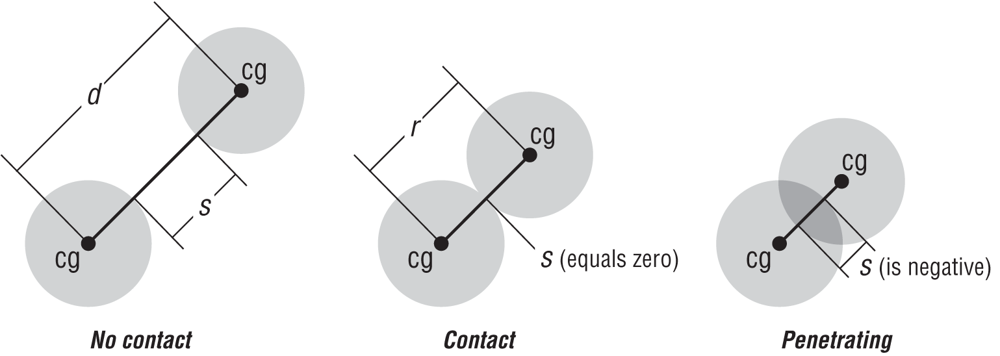
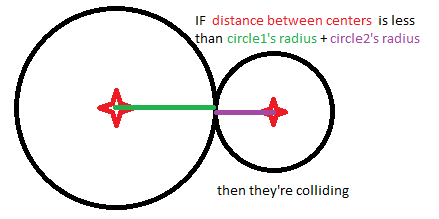
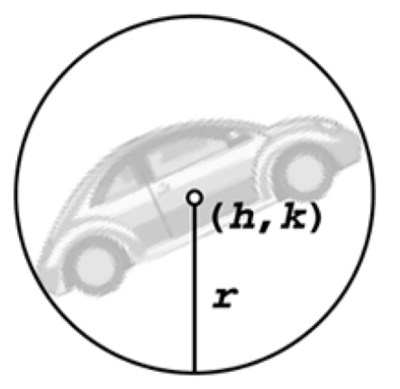

# Otkrivanje sudara krugom

Otkrivanje sudara krugom (ili sferom u 3D) se vrši tako što se centar kruga postavi u centar predmeta, pa se meri rastojanje poluprečnikom. Ova metoda je neprecizna i ne odgovara za sve predmete.







Bitna prednost krugova je što jednako dobro rade i sa rotiranim predmetima.

A circle is represented by a radius and point. Here is what your circle structure ought to look like:
```java
struct Circle
{
  float radius
  Vec position
};
```

Testing for whether or not two circles intersect is very simple: take the radii of the two circles and add them together, then check to see if this sum is greater than the distance between the two circles. An important optimization is to get rid of any need to use the square root operator:

```
float Distance( Vec2 a, Vec2 b )
{
  return sqrt( (a.x - b.x)^2 + (a.y - b.y)^2 )
}

bool CirclevsCircleUnoptimized( Circle a, Circle b )
{
  float r = a.radius + b.radius
  return r < Distance( a.position, b.position )
}

bool CirclevsCircleOptimized( Circle a, Circle b )
{
  float r = a.radius + b.radius
  r *= r
  return r < (a.x + b.x)^2 + (a.y + b.y)^2
}
```

Može i ovako:
```js
var circle1 = {radius: 20, x: 5, y: 5}
var circle2 = {radius: 12, x: 10, y: 5}

function intersect(circle1, circle2) {
  var dx = circle1.x - circle2.x
  var dy = circle1.y - circle2.y
  var distance = Math.sqrt(dx * dx + dy * dy)
  return (distance < circle1.radius + circle2.radius)
}
```

You can extend this process to 3D:
```js
function intersect(sphere, other) {
  var distance = Math.sqrt((sphere.x - other.x) * (sphere.x - other.x) +
                           (sphere.y - other.y) * (sphere.y - other.y) +
                           (sphere.z - other.z) * (sphere.z - other.z))
  return distance < (sphere.radius + other.radius) }
}
```
