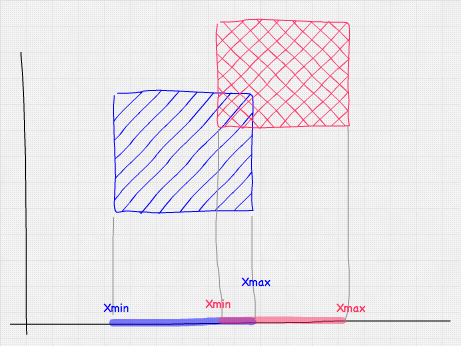
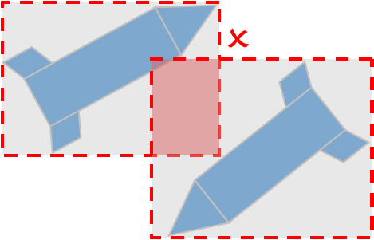
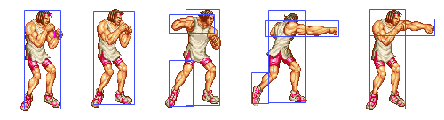

# Otkrivanje sudara kutijom

Otkrivanje sudara kutijom je osnovni metod za 2D i 3D, prost za primenu i jeftin za računanje, sve dok nema rotacije.

Osno poravnata granična kutija (*axis aligned bounding box*, skraćeno AABB) je četvorougaonik kojim omeđimo predmet igre, radi lakšeg otkrivanja sudara. The overlapping between two non-rotated boxes can be checked with logical comparisons alone, whereas rotated boxes require trigonometric operations, which are slower to calculate.

There are a few different ways to represent an AABB, this is the simplest (represent the top left and bottom right corners):
```java
struct AABB
{
  Vec2 min;
  Vec2 max;
};
```

In order to tell whether two AABB shapes are intersecting you will need to have a basic understanding of the Separating Axis Theorem (SAT). SAT essentially states if you are able to draw a line to separate two polygons, then they do not collide. Here's a test which makes use of the SAT:

```java
bool AABBvsAABB( AABB a, AABB b )
{
  // Exit with no intersection if found separated along an axis
  if(a.max.x < b.min.x or a.min.x > b.max.x) return false
  if(a.max.y < b.min.y or a.min.y > b.max.y) return false

  return true
}
```

Međutim, moguće je kutiju predstaviti i ovako:
```js
var rect1 = {x: 5, y: 5, width: 50, height: 50}
var rect2 = {x: 20, y: 10, width: 10, height: 10}
```

2D verzija:
```js
function isBoxCollide(rect1, rect2) {
  return (rect1.x < rect2.x + rect2.width &&
     rect1.x + rect1.width > rect2.x &&
     rect1.y < rect2.y + rect2.height &&
     rect1.height + rect1.y > rect2.y) {
  }  
}
```

3D verzija:
```js
function intersect(a, b) {
  return (a.minX <= b.maxX && a.maxX >= b.minX) &&
         (a.minY <= b.maxY && a.maxY >= b.minY) &&
         (a.minZ <= b.maxZ && a.maxZ >= b.minZ);
}
```



No, ovaj metod je dosta neprecizan i dovodi do lažnih sudara:



If you have entities that will be rotating, you can constantly modify the dimensions of box so it still wraps the object:


# Sistem sudara sa više kutija (*bounding box collision with multiple boxes*)

It isn't so costly and is easier to implement. You will break the sprite down into smaller rectangles. You loop through the rectangles to see if they intersect the rectangle you are intrested in.



# Primena

Metod gole sile (*brute force*) za otkrivanja sudara kutijom, proverom svakog predmeta sa svakim:

```js
BruteForceTech.prototype.queryForCollisionPairs = function(){
    var i, j, e1, e2, pairs = [], entityLen = this.entities.length;
    this.collisionTests = 0;

    for( i = 0; i < entityLen; i++ ){
        e1 = this.entities[i];

        for( j = i+1; j < entityLen; j++ ){
            e2 = this.entities[j];
            this.collisionTests += 1;

            if( this.aabb2DIntersection(e1, e2) === true ){
                pairs.push( [e1, e2] );
            }
        }
    }
    return pairs;
}

BruteForceTech.prototype.aabb2DIntersection = function(a, b){
    if (
        a.min[0] > b.max[0] || a.min[1] > b.max[1]
        || a.max[0] < b.min[0] || a.max[1] < b.min[1]
    ) {
        return false;
    } else {
        return true;
    }
}
```

There is a trick here to make sure we don’t testing objects more than once. The inner loop always starts at i + 1 as opposed to 0. This ensures that anything “behind” i is never touched by the inner loop.

http://mozdevs.github.io/gamedev-js-3d-aabb/
