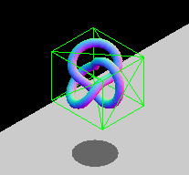

# Otkrivanje sudara kutijom

Otkrivanje sudara kutijom je osnovni metod za 2D i 3D, prost za primenu i jeftin za računanje, sve dok nema rotacije.

Metod osno-poravnatih graničnih kutija (*axis-aligned bounding boxes*, skraćeno AABB) se sastoji od uokvirivanja predmeta igre u nerotirajuće kutije, i provere da li se te kutije negde preklapaju. The overlapping between two non-rotated boxes can be checked with logical comparisons alone, whereas rotated boxes require trigonometric operations, which are slower to calculate.

```js
function intersect(a, b) {
  return (a.minX <= b.maxX && a.maxX >= b.minX) &&
         (a.minY <= b.maxY && a.maxY >= b.minY) &&
         (a.minZ <= b.maxZ && a.maxZ >= b.minZ);
}
```


No, ovaj metod je dosta neprecizan i dovodi do lažnih sudara:


If you have entities that will be rotating, you can constantly modify the dimensions of box so it still wraps the object:



# Sistem sudara sa više kutija (*bounding box collision with multiple boxes*)

It isn't so costly and is easier to implement. You will break the sprite down into smaller rectangles. You loop through the rectangles to see if they intersect the rectangle you are intrested in.


# Primena

Metod gole sile (*brute force*) za otkrivanja sudara kutijom, proverom svakog predmeta sa svakim:

```js
BruteForceTech.prototype.queryForCollisionPairs = function(){
    var i, j, e1, e2, pairs = [], entityLen = this.entities.length;
    this.collisionTests = 0;

    for( i = 0; i < entityLen; i++ ){
        e1 = this.entities[i];

        for( j = i+1; j < entityLen; j++ ){
            e2 = this.entities[j];
            this.collisionTests += 1;

            if( this.aabb2DIntersection(e1, e2) === true ){
                pairs.push( [e1, e2] );
            }
        }
    }
    return pairs;
}

BruteForceTech.prototype.aabb2DIntersection = function( objA, objB ){
    var  a = objA.getAABB()
        ,b = objB.getAABB();

    if (
        a.min[0] > b.max[0] || a.min[1] > b.max[1]
        || a.max[0] < b.min[0] || a.max[1] < b.min[1]
    ) {
        return false;
    } else {
        return true;
    }
}
```

There is a trick here to make sure we don’t testing objects more than once. The inner loop always starts at i + 1 as opposed to 0. This ensures that anything “behind” i is never touched by the inner loop.
