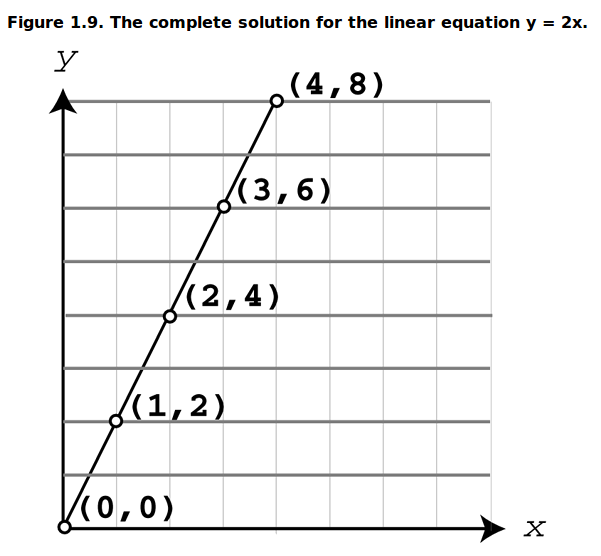
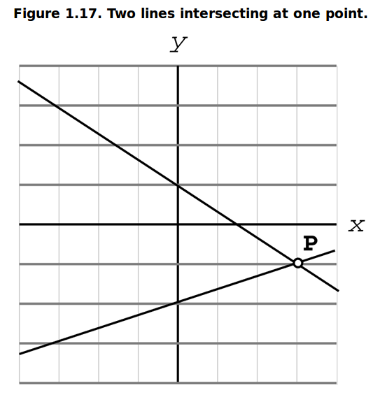

## Linearna jednačina

Linearna jednačina se grafički može predstaviti pravom linijom. Na primer:
```
y = 2x
```
So, every straight line is an equation of the form `Ax + By = C`, where A and B are not both 0.



One of the most important elements of a line is its slope (nagib).

## Otkrivanje sudara presekom linija

Kako saznati da li se dve linije (koje mogu biti zidovi) seku? Postaviš linearne jednačine za njih, povežeš ih u sistem linearnih jednačina, i rešiš matematički.

When solving a system of two linear equations, you're really searching for the intersection of two lines. The solution set is the set of all the points that satisfy both equations.



Dve linije se mogu seći ili ići jedna preko druge ili biti paralelne.

A system of two linear equations in the same plane has:
* Exactly one solution if the two graphs have different slopes.
* An infinite set of solutions if both graphs have the same slope and y-intercept.
* No solution if the graphs have the same slope but different y-intercepts.

## Otkrivanje sudara presekom linije i ravni (*line–plane intersection*)

Imagine a fast bullet and a collision detection with a relatively small target. Because the target is small and the bullet is incredibly fast, it could happen that on successive frames the bullet is on opposite sides of the target. No single frame exists where the bullet is actually inside the target.

The only way to find if the intersection happen is to test if the ray intersected the target.
