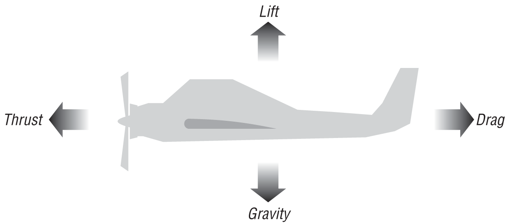
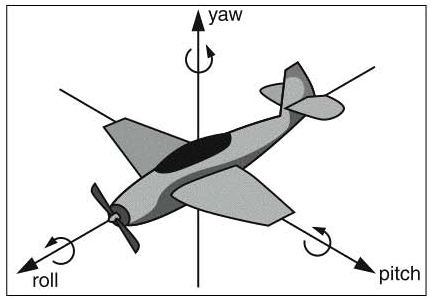
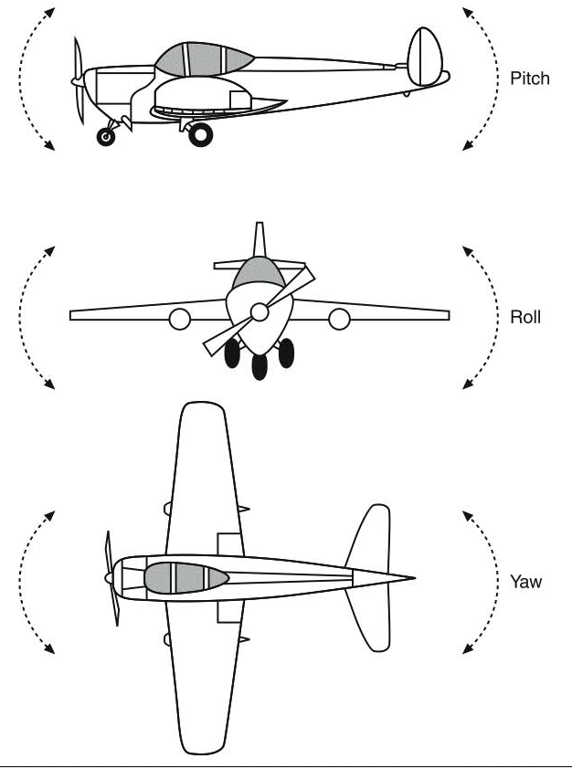
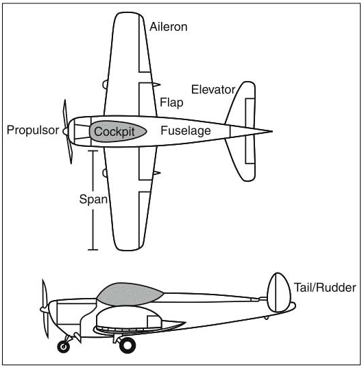

# Avion

There are four major forces that act on an airplane in flight: gravity, lift, thrust, and drag.

* Gravity is the force that tends to pull the aircraft to the ground.
* Lift is the force generated by the wings of the aircraft to counteract gravity and enable the plane to stay aloft.
* Thrust force generated by the aircraft’s engine increases velocity and provides forward motion; without it, the aircraft’s wings can’t generate lift and the aircraft won’t fly.
* Drag counteracts the thrust force, tending to impede the aircraft’s motion.

