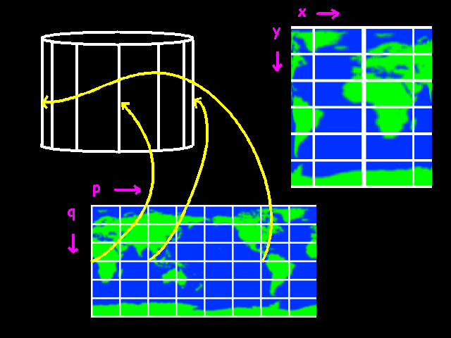
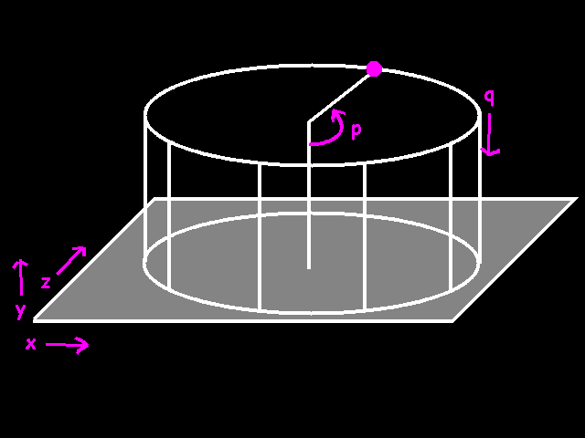

# Mapiranje zemlje

We have a destination bitmap and the source bitmap. If the source bitmap were a map of the earth, we would make a sphere that looks exactly like the earth seen from space. In between we have to do some transformation and there is where the sine and cosine come in to play.

We go through all pixels of the destination bitmap and try to figure out which pixel of the source bitmap should go there. What we need here is a basic formula that gives us the coordinates (p, q) on the source bitmap given the coordinates (x, y) on the destination bitmap.

## Mapiranje cilindra (Cylindrical mapping)

Let's make it a bit simpler. Let's start with a cylinder instead of a sphere. We are going to make a cylinder in the way we did it in kindergarten. We take a nice flat piece of paper (the source bitmap) and roll it up. The bitmap wraps around so that the topright pixel of the source bitmap is right next to the topleft pixel.



Suppose we wanted to go from source to destination. We want to know for each position (p, q) on the cylinder where on the screen it should go. Coordinate y is simple. It simply equals q. x is more difficult. If the angle p is 0, the x coordinate should be the center of the cylinder plus the radius. If p is 90 degrees, the x coordinate should be in the center. If p is 180, it should be the center minus the radius. The function which does exactly that is: the cosine!

```
x = center + radius * cos(p)
y = q
```

We are still missing the z coordinate here. A cylinder is a three-dimensional object so we can also calculate the z coordinate for each point.
```
z = center + radius * sin (p)
```



If we want to work from the destination out, we have to turn these formula's around, like this:
```
q = y
cos (p) = (center - x) / radius
```
odnosno:
```
p = arccos ((center - x) / radius)
```

Primer c funkcije za mapiranje cilindra:
```java
/*
    mapped_cylinder() maps a bitmap onto a cylinder.

    BITMAP *target = bitmap to display
    int cx = horizontal position of the center of the cylinder
    int top = position of the top of the cylinder
    int r = radius of the cylinder
    int h = height of the cylinder
    BITMAP *map = the thing that is going to be mapped onto the cylinder
*/
void mapped_cylinder (BITMAP *target, int cx, int top, int r, int h, BITMAP *map)
{    
    int x, y; // coordinates on the target bitmap
    int p, q; // coordinates on the source bitmap

    // for each line:
    for (y = 0; y < h; y++)
    {
        //q is the same throughout this line. we can calculate it already
        //y has a range from 0..h, and we have to change that into a
        //range from 0..map->h
        //so we use this expression:
        q = y * map- >h / h;

        // for each pixel in the line:
        for (x = - r; x < r; x++)
        {
        fixed temp; // a temporary variable we use for calculating p

        // right now, x is between -r and r.
        // x must be between 1 and -1 before we can use asin
        // so therefor we divide by r
        temp = itofix(x) / r;

        // now we can use the asin() function
        temp = fixasin (temp);
        // the result is an angle between -64 and 64.        

        // the next expression changes that to angle between 0..64 and 192..255,
        // which is equivalent, because 192 == -64,
        // but postive integers are a bit easier to deal with
        temp &= 0xFFFFFF;

        // the actual p has to cover the whole bitmap
        // so we go from 0..256 to 0..bmp->w
        p = fixtoi (temp) * (map->w-1) / 256;

        // now we know p and q. copy a pixel.
        putpixel (target, x + cx, top + y,
              getpixel (map, p, q)
              );
        }
    }
}
```

## Mapiranje sfere


How do we go from p,q to x, y. And let's not forget z this time. This time, the y coordinate should also have some sine in it, because it reaches its maximum when q is 90, and when q is over 90 it should go back again.

```
x = center + radius * cos (p)
y = center + radius * sin (q)
z = center + radius * sin (p)
```

Well this gives us some kind of 2-way cylinder. Actually we need to scale x and z down a bit:
```
x = center + radius * cos (p) * scale_factor
y = center + radius * sin (q)
z = center + radius * sin (p) * scale_factor
```

The scale factor should be 0 when q is 90 or -90, and 1 when q is 0:

```
x = center + radius * cos (p) * cos(q)
y = center + radius * sin (q)
z = center + radius * sin (p) * cos(q)
```

Voilá

A sad formule u obrnutom smeru:
```
q = arcsin ((center - y) / radius)
p = arccos ((center - x) / (radius * cos(q))
```

Primer c funkcije za mapiranje sfere:
```java
/*
    mapped_sphere() maps a bitmap onto a sphere and displays it.

    BITMAP *target = bitmap to display onto
    int cx, cy = center of the sphere
    int r = radius of the sphere
    BITMAP *map = bitmap to map onto the sphere
*/
void mapped_sphere (BITMAP *target, int cx, int cy, int r, BITMAP *map)
{
    int x, y; // coordinates on the target bitmap
    int p, q; // coordinates on the source bitmap

    // for each line
    for (y = -r; y < r; y++)
    {         
        fixed temp_p, temp_q;
        fixed q_cos;

        // y ranges from -r to r now.
        // for asin() we need a number between -1 and 1.
        // therefor we need to divide by r
        temp_q = itofix (y) / r;
        // now we can apply the formula
        temp_q = fixasin (temp_q);        
        // we store the cosine of temp_q, because we will need it a couple of times
        // later on
        q_cos = fixcos (temp_q) * r;

        //we can calculate q already
        //temp_q is an angle ranging from -64 to 64
        //q must range from 0 to map->h
        //so we use the following expression:
        q = fixtoi (temp_q + itofix (64)) * (map->h-1) / 128;

        // instead of making x go from -r to +r,
        // we skip the parts in the corners that lay outside the sphere
        for (x = - fixtoi (q_cos) + 1; x < fixtoi(q_cos) - 1; x++)
        {
              // at the very top of the sphere, q_cos can reach 0
              // this can create a "division by zero" error
              // so we need to check that first
              if (q_cos != 0)
                  // if not zero, we can go ahead and apply the formula
                  // to calculate p
                  temp_p = fixasin (fixdiv (itofix (x), q_cos));
              else
                  temp_p = 0;

              //temp_p ranges from -64 to 64 now
              //again, we change that so we only have positive numbers
              temp_p &= 0xFFFFFF;

              // now we can finally calculate p
              // we change a range from 0..64 - 192..255 to
              // a range from 0..map->w
              p = fixtoi (temp_p) * (map->w-1) / 256;

              // we know p and q. copy a pixel.
              putpixel (target, x + cx, y + cy,
                  getpixel (map, p, q));
        }
    }
}
```
