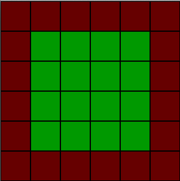
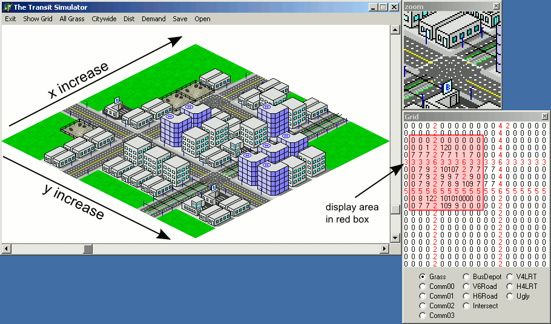

# Model mape

Postavljanje proste mape koja razlikuje dve vrste terena (npr. `0` - zemlju i `1` - zid) u skoro svim jezicima izgleda ovako:

```js
[
  [1,1,1,1,1,1],
  [1,0,0,0,0,1],
  [1,0,0,0,0,1],
  [1,0,0,0,0,1],
  [1,0,0,0,0,1],
  [1,1,1,1,1,1]
]
```

Kada se oslika na ekranu, mapa izgleda ovako:



Možemo dodati još i razne kule po uglovima zidina:
```js
[
  [3,1,1,1,1,4],
  [2,0,0,0,0,2],
  [2,0,0,0,0,2],
  [2,0,0,0,0,2],
  [2,0,0,0,0,2],
  [6,1,1,1,1,5]
]
```

# Iscrtavanje mape

```js
for (i, loop through rows)
 for (j, loop through columns)
  x = j * tile width
  y = i * tile height
  tileType = levelData[i][j]
  placetile(tileType, x, y)
```

Recimo da je tile width and height for this example are both 50px, which makes up the total level size of 300x300px.

Ovu mapu je najlakše prikazati iz ptičje perspektive. Ali takođe ju je moguće iskoristiti za bilo koju drugu projekciju, uključujući izometrijsku (odozgo postrance):


# Izometrijska projekcija

In video games, "isometric" je vrsta paralelne projekcije with a 2:1 pixel ratio, where the viewpoint is rotated slightly to reveal other facets of the game environment than are typically visible from a top-down perspective or side view, thereby producing a three-dimensional effect. 

For the isometric view, petlja iz prethodnog primera ostaje ista, only the `placeTile()` function changes. We need to calculate isometric coordinates inside the loops, instead of cartesians:

```js
// Cartesian to isometric
isoX = cartX - cartY
isoY = (cartX + cartY) / 2

// Isometric to Cartesian
cartX = (2 * isoY + isoX) / 2
cartY = (2 * isoY - isoX) / 2
```

These functions can convert from one system to another:
```js
function IsometricToCartesian(point) {
  var tempPt = new Point(0, 0)
  tempPt.x = (2 * point.y + point.x) / 2
  tempPt.y = (2 * point.y - point.x) / 2
  return tempPt
}

function cartesianToIsometric(point) {
  var tempPt = new Point(0,0)
  tempPt.x = point.x - point.y
  tempPt.y = (point.x + point.y) / 2
  return tempPt
}
```


Izometrijska mapa sa svega nekoliko različitih tipova terena može izgledati ovako:


